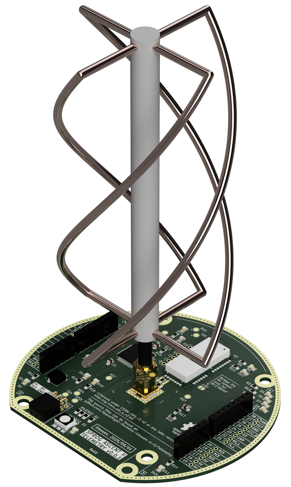
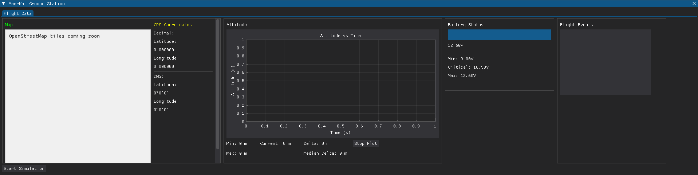
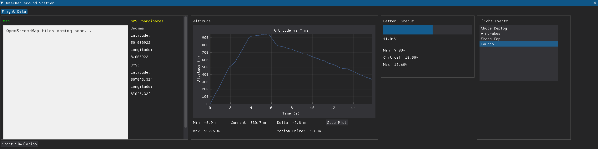

# ASCENT II Experimental Rocket Telemetry System

## Overview
The ASCENT II telemetry system is part of the ASCENT II flight computer of the student rocketry association **Spaceflight Rocketry Gießen e.V.**, developed for the ARCHER experimental rocket.  
This 868 MHz telemetry system allows bidirectional data exchange between rockets and ground stations with a minimum range of **18 km** and a minimum data rate of **1.2 kbps**.  

With this system, the flight computer can transmit sensor and status data to the ground station and reliably receive and execute telecommands.

## Our Team's Responsibility
We are responsible for:
- Receiving flight data from our rockets
- Sending radio commands to our rockets
- Displaying live telemetry on a screen or UI
- Storing flight data for post-flight analysis

## Initial Design Requirements
When designing our telemetry system, we focused on:
- **Lightweight** antennas for minimal impact on rocket performance
- **High range** communication
- **Low production cost**
- **Reliable and confident** data transfer

Initial design proposal:

## General Design Specs
- **Frequency:** 869.5 MHz  
- **Range:** Minimum 18 km  
- **Data rate:** 1.2 kbps
- **Antennas:** Onboard QFH antenna and helix antenna at the ground station

## Repository Contents
This repository contains all files necessary to reproduce the telemetry system, including hardware, firmware, and software.

### 1. Antenna Hardware
In the future, this repository will include simulations, design files and assembly instructions for our custom made antennas.
<!-- 

  
- **Description:** Designs for telemetry antennas -->

### 2. Electronics Hardware

  
  

- **Description:** Circuit and PCB designs for onboard and ground station electronics
- **Included:** 
	- Schematics
	- PCB design files
	- Bill of Materials
	- 3D models

### 3. Firmware (Electronics)
- **Description:** Firmware for the onboard and ground station electronics written in C++  
- **Included:** 
- Radiocrafts RC1780HP-RC232 code library
- Package encoding and decoding code library
- Onboard and ground station electronics firmware  

### 4. Software (Groundstation UI)
  
  

- **Description:** Python-based software to display telemetry data on a modern, minimalistic interface  
- **Current Features:**  
  - Position/GPS (raw data + map view)  
  - Height (plotted over time)  
  - Acceleration (raw data)  
  - Battery voltage (with visual limits)  

## Documentation 

## Safety
Please note that radio systems may be subject to local regulations. Ensure that any testing or deployment of these antennas complies with national and regional laws regarding RF transmission. The project maintainers are not responsible for misuse or regulatory violations.  

## License

Copyright SPROG – Spaceflight Rocketry Giessen e.V. 2025. 
This source describes Open Hardware and is licensed under the CERN-OHL-S v2. 
You may redistribute and modify this source and make products using it under the terms of the [CERN-OHL-S v2 or any later version](LICENSE). 
This source is distributed WITHOUT ANY EXPRESS OR IMPLIED WARRANTY, INCLUDING OF MERCHANTABILITY, SATISFACTORY QUALITY AND FITNESS FOR A PARTICULAR PURPOSE. Please see the CERN-OHL-S v2 for applicable conditions. 
Source location: https://github.com/Spaceflight-Rocketry-Giessen-e-V/Telemetry 
As per CERN-OHL-S v2 section 4, should you produce hardware based on this source, you must where practicable maintain the Source Location in its documentation or license information. 
