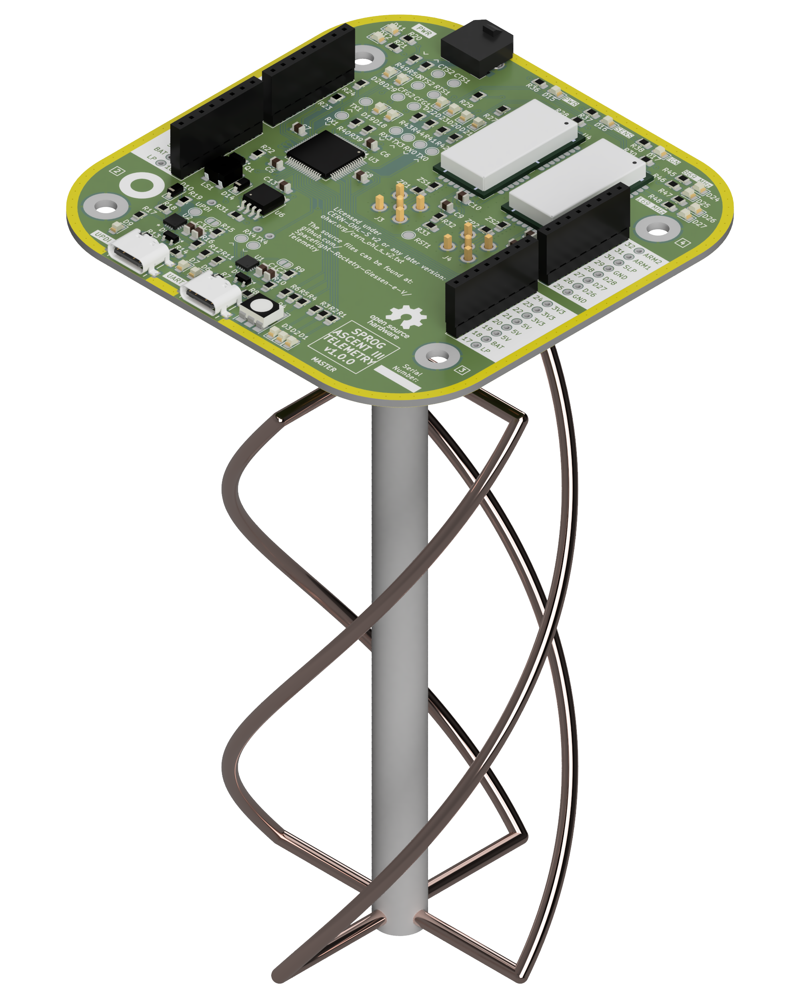
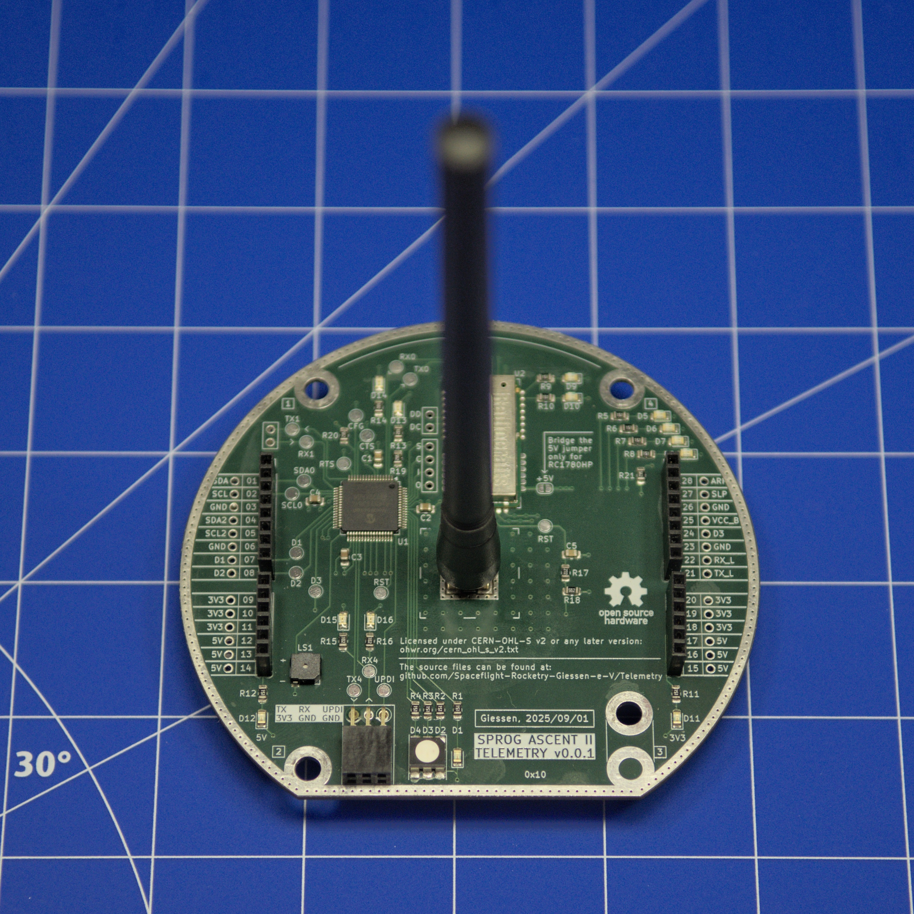
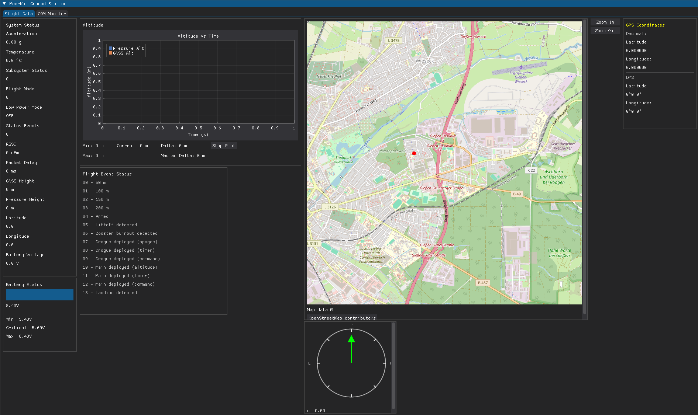

# ASCENT Experimental Rocket Telemetry System

## Overview
The ASCENT telemetry system is part of the ASCENT flight computer of the student rocketry club [Spaceflight Rocketry Gießen e.V.](https://spaceflight-rocketry-giessen.de/), developed for the PIPE 2 and ARCHER experimental rockets.  
This 868 MHz telemetry system allows bidirectional data exchange between rockets and ground stations with a minimum range of 18 km and a minimum data rate of 1.2 kbps.
The design can also be used in areas outside of rocketry like Smart Home or RC.

## Design Requirements

- Receiving flight data from our rockets
- Sending radio commands to our rockets
- Displaying live telemetry on a screen or UI
- Storing flight data for post-flight analysis

## Actual performance
In January 2026, we performed our first long range test over a distance of 2 km. Despite poor weather conditions and object inside the first Fresnel zone, the received signal strength was on par with the theoretical maximum without any connection losses. This test ruled out major design flaws which could result in large losses.

This excellent performance was confirmed by multiple medium range tests.

## Repository Contents
This repository contains all files necessary to reproduce the telemetry system, including hardware, firmware, and software.
It also includes user manuals and design rationals which help to understand and adapt the system.

### 1. Antenna Hardware
In the future, this repository will include simulations, design files and assembly instructions for our custom made antennas.
<!-- 

  
- **Description:** Designs for telemetry antennas -->

### 2. Electronics Hardware

Included: 
- Schematics
- PCB design files
- Bill of Materials
- 3D models

In the future, there will be a separate electronics design for the groundstation system.

### 3. Electronics Firmware

Included:
- Onboard and ground station electronics firmware 
- Radiocrafts RC1780HP-RC232 code library
- Package encoding and decoding code library 

### 4. Groundstation UI Software
  

Python-based software to display telemetry data on a modern, minimalistic interface with the ability to store flight data. In the future, sending radio command directly in UI will be possible.

Included:
- GNSS map view
- Height plot over time
- Acceleration indicator
- Battery voltage indicator with visual warnings
- Status event indicator

## Legal notice
Please note that radio systems may be subject to local regulations. Ensure that any testing or deployment of these systems complies with national and regional laws regarding RF transmission. The project maintainers are not responsible for misuse or regulatory violations.  

## License

Copyright Spaceflight Rocketry Giessen e.V. 2026. 
This source describes Open Hardware and is licensed under the CERN-OHL-S v2. 
You may redistribute and modify this source and make products using it under the terms of the [CERN-OHL-S v2 or any later version](LICENSE). 
This source is distributed WITHOUT ANY EXPRESS OR IMPLIED WARRANTY, INCLUDING OF MERCHANTABILITY, SATISFACTORY QUALITY AND FITNESS FOR A PARTICULAR PURPOSE. Please see the CERN-OHL-S v2 for applicable conditions. 
Source location: https://github.com/Spaceflight-Rocketry-Giessen-e-V/Telemetry 
As per CERN-OHL-S v2 section 4, should you produce hardware based on this source, you must where practicable maintain the Source Location in its documentation or license information. 
