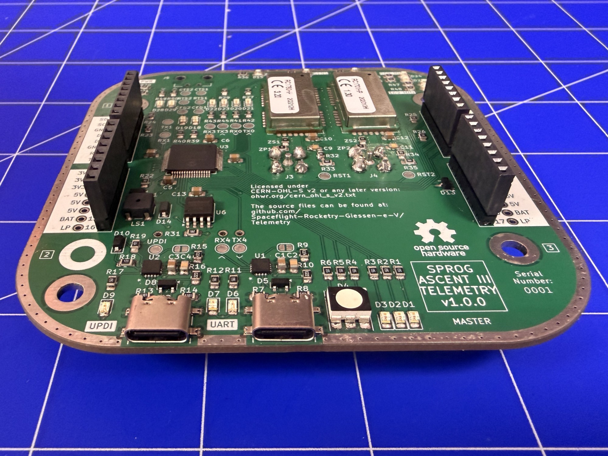

# ASCENT Experimental Rocket Telemetry System

|
 | 

|
|---|---|
|
[The Onboard System](/onboard/)
|
[The Groundstation System](/groundstation/)
|

---

## Overview

The ASCENT telemetry system is part of the ASCENT flight computer of the student rocketry club [Spaceflight Rocketry Gießen e.V.](https://sprog-ev.de/en/), which is being developed for the PIPE and ARCHER experimental rockets.
This dual-frequency 169/869 MHz telemetry system based on Radiocrafts RC232 radio modules allows bidirectional data exchange between rockets and groundstations with a range of 20 km and a minimum data rate of 1.2 kbps.
The design can easily be adapted for uses outside of rocketry like Smart Home or RC.

## Basic Functionality

- Receiving flight data from the rocket
- Sending radio commands to the rocket
- Displaying live telemetry on a serial monitor or UI

## Actual Performance

In January 2026, we performed our first long range test over a distance of 2 km. Despite poor weather conditions and objects inside the first Fresnel zone, the received signal strength was on par with the theoretical maximum without any unaccounted losses. This test ruled out major design flaws.

This excellent performance was confirmed by multiple medium range tests.

In April 2026, the system was successfully tested on the PIPE 2 rocket to an altitude of 350 m and experienced no link issues during the whole flight.

---

## Repository Contents

This repository contains all files necessary to reproduce the telemetry system, including hardware, firmware, software, and documentation.

### 1. Antenna Hardware

So far, this repository includes [design files](/groundstation/antenna/helical/) and [assembly instructions](/docs/helical_antenna_assembly_manual.md) for our helical 869 MHz groundstation antenna.

We also do our own FDTD-simulations which can be found [here](groundstation/antenna/helical/Simulation/Helical_Antenna.m).

Currently, we are developing an 869 MHz QFH antenna.

### 2. Electronics Hardware

The telemetry system is based on separate [onboard](/onboard/pcb/) and [groundstation](/groundstation/pcb/) electronics.
The groundstation uses a modular approach with a [motherboard](/groundstation/pcb/Motherboard/) to which up to four [daughterboards](/groundstation/pcb/Daughterboard/) with radio modules can be connected.

The repository includes for each system the KiCad design files including custom component schematic, footprint, and 3D model libraries, the PDF schematic, the Gerber production files, the bill of material (BOM) and an interactive BOM (iBOM). 
Renderings, images, and 3D models of the electronics are also included.

The [onboard mounting structure](/onboard/mounting%20structure/), the [motherboard and daughterboard casings](/groundstation/casing/) are included separately.

### 3. Firmware

- [Onboard Firmware](/onboard/firmware/)
- [Groundstation Firmware](/groundstation/firmware/) 
- [Radiocrafts RC17xHP-RC232 Library](/libraries/Radiocrafts_RC17xxHP_RC232/)
- [Dynamic Package Codec (Encoding/Decoding) Library](/libraries/DynamicPacketCodec/)
- [Firmware Functions/Classes Reference](https://spaceflight-rocketry-giessen-e-v.github.io/Telemetry/)

### 4. Groundstation UI Software

[Python-based software](/groundstation/gui/) to display live telemetry data on a modern, minimalistic interface with the ability to store flight data and send radio commands. 

Widgets include a GNSS map view, a height plot over time, a acceleration plot over time, a battery voltage indicator with visual warnings, a connection quality indicator with visual warnings and a status event indicator.

### 5. Documentation

- [User Manual](/docs/user_manual.md) and [Operations Cheatsheet](/docs/operations_cheatsheet.md)
- [Design Overview/Rationals](/docs/design_overview.md)
- Documentation of the [Packet Structure](/docs/packet_structure.md) and the [Linkbudget Calculation](/docs/linkbudget.ipynb)
- [And more...](/docs/)

---

## Legal Notice

Please note that radio systems may be subject to local regulations. Ensure that any testing or deployment of these systems complies with national and regional laws regarding RF transmission. The project maintainers are not responsible for misuse or regulatory violations.  

## License

Copyright Spaceflight Rocketry Giessen e.V. 2026 
This source describes Open Hardware and is licensed under the CERN-OHL-S v2. 
You may redistribute and modify this source and make products using it under the terms of the [CERN-OHL-S v2 or any later version](LICENSE). 
This source is distributed WITHOUT ANY EXPRESS OR IMPLIED WARRANTY, INCLUDING OF MERCHANTABILITY, SATISFACTORY QUALITY AND FITNESS FOR A PARTICULAR PURPOSE. Please see the CERN-OHL-S v2 for applicable conditions. 
Source location: https://github.com/Spaceflight-Rocketry-Giessen-e-V/Telemetry 
As per CERN-OHL-S v2 section 4, should you produce hardware based on this source, you must where practicable maintain the Source Location in its documentation or license information. 
