# Design overview

This document provides detailed information about our electronics, firmware, antenna, and GUI systems. It also covers rationales used during the design process.

<p align="center">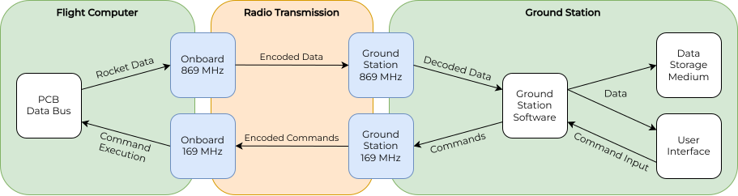</p>

The whole system is designed for an effective range of 18 km. To accomplish this goal, the signal strength at the receiver must be strong enough to be processed. Our link budget calculation as outlined in [this document](linkbudget.ipynb) ensures that our system meets this requirement.

---

# Table of Contents

- [Design overview](#design-overview)
- [Table of Contents](#table-of-contents)
- [Electronics](#electronics)
  - [Design Overview](#design-overview-1)
    - [Groundstation MB/DB Approach](#groundstation-mbdb-approach)
    - [Onboard Electronics](#onboard-electronics)
  - [Design Details](#design-details)
    - [Radio Frequencies](#radio-frequencies)
    - [Radio Modules](#radio-modules)
    - [Microcontroller](#microcontroller)
    - [PCB Stackup](#pcb-stackup)
    - [RF Traces](#rf-traces)
    - [USB UPDI Programmer](#usb-updi-programmer)
    - [Staggered Pin Rows / Lock Pattern](#staggered-pin-rows--lock-pattern)
  - [Groundstation Electronics Casings](#groundstation-electronics-casings)
  - [Onboard Electronics Mounting Structure](#onboard-electronics-mounting-structure)
- [Firmware](#firmware)
  - [Data Budget \& Packet Structure](#data-budget--packet-structure)
  - [Libraries](#libraries)
    - [Radio Module Library](#radio-module-library)
    - [Packet Encoding/Decoding Library](#packet-encodingdecoding-library)
- [Antennas](#antennas)
  - [Groundstation 869 MHz Helical Antenna](#groundstation-869-mhz-helical-antenna)
    - [Geometric Design](#geometric-design)
    - [Mechanical Design](#mechanical-design)
    - [Simulations](#simulations)
  - [Groundstation 169 MHz Dipole Antenna](#groundstation-169-mhz-dipole-antenna)
  - [Onboard 869 MHz QFH Antenna](#onboard-869-mhz-qfh-antenna)
    - [Geometric Design](#geometric-design-1)
    - [Mechanical Design](#mechanical-design-1)
    - [Simulations](#simulations-1)
- [GUI software](#gui-software)
  - [Architecture](#architecture)
  - [Flight Data Tab](#flight-data-tab)
  - [Settings Tab](#settings-tab)
  - [Data Flow \& Logging](#data-flow--logging)

---

# Electronics

## Design Overview

### Groundstation MB/DB Approach

|  |  |
| :---------------------------------------------------------------------------------------------: | :-------------------------------------------------------------------------------------------------: |
| [Motherboard](/groundstation/pcb/Motherboard/)| [Daughterboard](/groundstation/pcb/Daughterboard/)|


The system is based on a modular approach consisting of a motherboard and one or more daughterboards. The motherboard integrates the microcontroller (AVR128DB64), while the daughterboards host the radio modules (RC17xx series).

This architecture allows multiple daughterboards to be connected to the motherboard via a standard 15-pin VGA connector. As a result, different radio modules operating on different frequency bands can be used within the same system.

In the current configuration, the system is designed to use 169.5 MHz for command transmission and 869.5 MHz for telemetry data.

The use of the LEDs is described in the [operations cheatsheet](operations_cheatsheet.md).

### Onboard Electronics

The onboard PCB is based on the standard layout of our rocketry club, featuring a square design with round edges. Power and data are distributed via stackable pin headers located on the left and right sides. Generally, cheap stackable headers which can be found on eBay or Aliexpress can be used. We opted to use [Samtec ESQ pin sockets](https://www.digikey.de/de/products/detail/samtec-inc/ESQ-108-13-G-S/1766188) due to their superior quality. An I2C connection is used for communication with other subsystems to gather sensor data and forward radio commands.

The system includes an RGB LED for status indication, three LEDs for subsystem status indication and five general-purpose LEDs. Additionally, all UART traces feature a LED indicator.

<p align="center">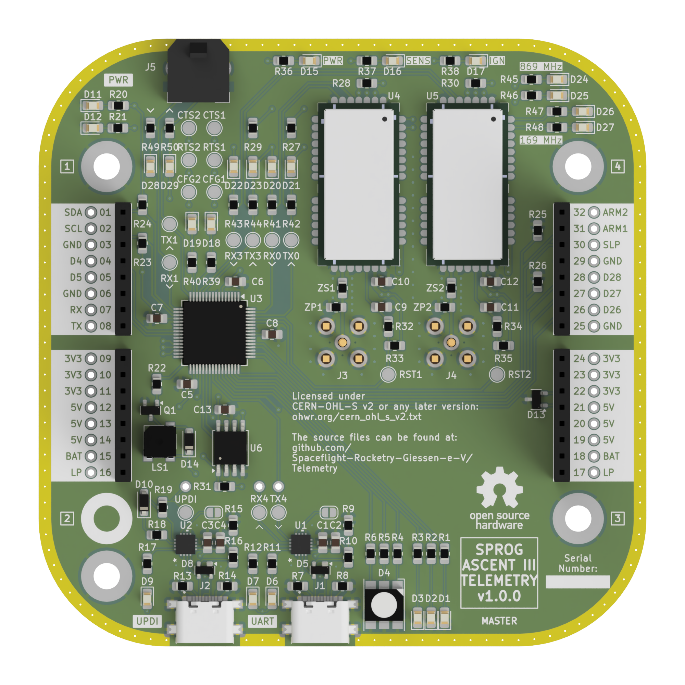</p>

### Previous Design

<p align="center"></p>

## Design Details

### Radio Frequencies

The license-free frequency bands in Germany are regulated by the Bundesnetzagentur. Frequencies between 100 MHz and 2400 MHz are of primary interest to us. The relevant regulations can be found in the ["Allgemeinzuteilungen von Frequenzen"](https://www.bundesnetzagentur.de/DE/Fachthemen/Telekommunikation/Frequenzen/Allgemeinzuteilungen/start.html). In this case the regulation of SRD devices applies. 

The frequency band between 169.4 MHz and 169.475 MHz can be used with an output power (EIRP) of up to 27 dBm or 500 mW, with a duty cycle of 1 %. This limits the radio transmission to 36 seconds total per (continous) hour.

<p align="center">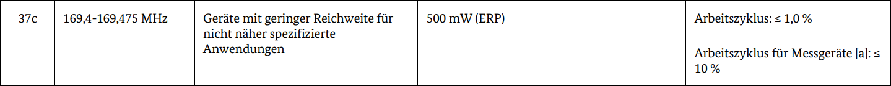</p>

The frequency band between 869.4 MHz and 869.65 MHz can be used with an output power (EIRP) of up to 27 dBm or 500 mW, with a duty cycle of 10 %. This limits the radio transmission to 6 minutes total per (continous) hour.

<p align="center"></p>

### Radio Modules

We chose the Radiocrafts RC17xxHP-RC232 radio modules which come in 169 MHz (RC1701HP) and 869 MHz (RC1780HP) variants. The modules can achieve output powers of up to 27 dBm and the operation is straightforward due to the UART interface. The datasheet can be found [here](https://radiocrafts.com/uploads/RC17xxHP-RC232_Datasheet.pdf). Additionally, there is a separate manual for the RC232 series of radio modules that includes all configuration commands and more information, available [here](https://radiocrafts.com/uploads/RC232_user_manual.pdf). Application notes can be downloaded [here](https://radiocrafts.com/resources/document-library/?rs=Application%20Notes).

The following tables show the available data rates and high power (27 dBm) radio channels of the RC1780HP-RC232 and RC1701HP-RC232 radio modules. The data is taken from the linked datasheet.

|Date Rate #|Data rate|Bandwidth|Modulation|
|---|---|---|--|
|1|tbd.|||
|2|0.3 kbit/s|12.5 kHz|2GFSK|
|3|0.6 kbit/s|12.5 kHz|2GFSK|
|**4**|**1.2 kbit/s**|**12.5 kHz**|**2GFSK**|
|5|2.4 kbit/s|12.5 kHz|2GFSK|
|6|tbd.|||
|7|4.8 kbit/s|12.5 kHz|2GFSK|
|8|9.6 kbit/s|12.5 kHz|4GFSK|
|9|9.6 kbit/s|25 kHz|2GFSK|
|10|19.2 kbit/s|50 kHz|4GFSK|
|11|tbd.|||
|12|38.4 kbit/s|100 kHz|2GFSK|
|13|50 kbit/s|100 kHz|2GFSK|
|14|76.8 kbit/s|200 kHz|2GFSK|
|15|100 kbit/s|200 kHz|2GFSK|

**RC1780HP-RC232 +27 dBm Channels**

|Channel #|Center Frequency|
|---|---|
|57|869.412500 MHz|
|59|869.437500 MHz|
|58|869.462500 MHz|
|60|869.487500 MHz|
|**61**|**869.512500 MHz**|
|62|869.537500 MHz|
|63|869.562500 MHz|
|64|869.587500 MHz|
|65|869.612500 MHz|
|66|869.637500 MHz|

**RC1701HP-RC232 +27 dBm Channels**

|Channel #|Center Frequency|
|---|---|
|**1**|**169.406250 MHz**|
|2|169.418750 MHz|
|3|169.431250 MHz|
|4|169.443750 MHz|
|5|169.456250 MHz|
|6|169.468750 MHz|
|7|169.412500 MHz|
|8|169.437500 MHz|
|9|169.462500 MHz|
|10|169.437500 MHz|

### Microcontroller

We use the AVR128DB64 microcontroller in the 64-pin LQFP version ([datasheet](https://ww1.microchip.com/downloads/en/DeviceDoc/AVR128DB28-32-48-64-DataSheet-DS40002247A.pdf)). It offers a decent improvement compared to beginner-friendly Arduino boards, while still being easy to use. The [AVR DB Arduino Core (DxCore)](https://github.com/SpenceKonde/DxCore) offers excellent firmware and hardware documentation.

The following image shows the pinout of the AVR128DB64 MCU and is taken from the DxCore documentation:

<p align="center">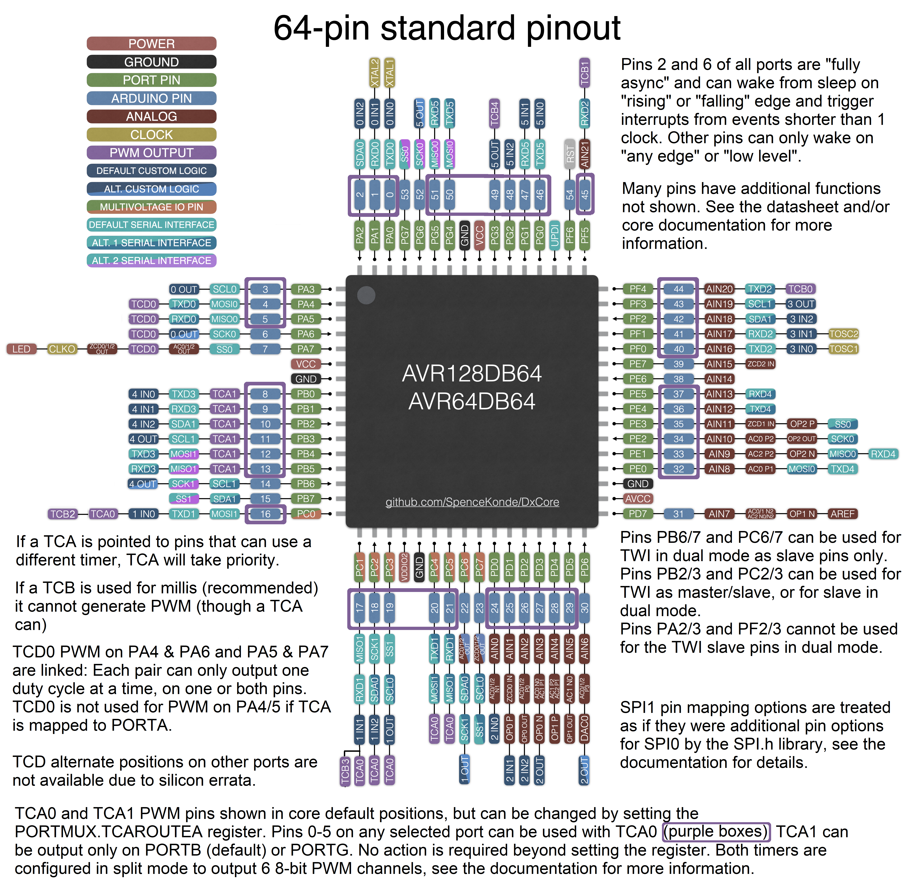</p>

### PCB Stackup

The electronics design (schematic and pcb) was done with the open source EDA software KiCad. We included the KiCad project with all necessary files.

During the pcb design process, we considered the Radiocrafts [RF PCB Layout Recommendation Application Note](https://radiocrafts.com/uploads/AN061_RF_PCB_Layout_Recommendations.pdf) and a [RF PCB Design Guide](https://www.proto-electronics.com/blog/routing-guidelines-rf-pcb). The PCB has a basic 4-layer stackup intended to reduce electromagnetic interference:
1) Components, signal traces, 50 Ohm RF trace
2) Continous ground plane
3) 5 V and 3.3 V power plane
4) Ground plane, signal traces 

Around the edge of the PCB, an exposed ground strip is included, connected by many vias to the solid ground plane (layer 2). The intend is to contain any electromagnetic emissions.

### RF Traces

There are three types of traces commonly used as RF signal traces: microstrip, stripline, and coplanar waveguide. For all types, there are several online calculators to obtain the correct strip width to have a characteristic impedence of 50 Ohms. We use a coplanar waveguide and the calculator included in Kicad.

Some PCB properties like Tmet, RHO, RGH, H, Er, and tand cannot be changed and depend on the PCB manufacturer. JLCPCB lists some parameters like Tmet, H, and Er in [this document](https://jlcpcb.com/impedance). For the other parameters, we used standard values.

For a 4 layer pcb like our onboard pcb: H = 0.2104 mm. For a 2 layer pcb like our groundstation daughterboard pcb: H = 1.6 mm.

For the groundstation daughterboard, our goal was to use the width of the 0805 matching component pads as the trace width and thus a variable separation S. The result is S = 0.22 mm:

<p align="center">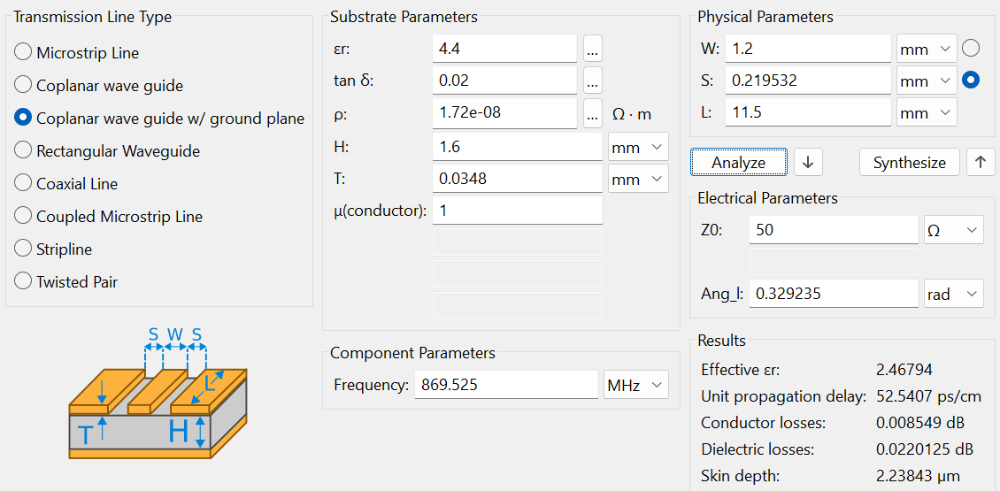</p>

Due to the different height of the onboard pcb, a trace width of 1.2 mm would lead to large values for S. Thus, we used a fixed separation S = 0.22 mm (same value as for the groundstation daughterboard) and a variable trace width. The result is W = 0.37 mm. Due to the different width of the matching components, this is not an ideal trace and might have a slighty different impedance. Matching is advised.

<p align="center">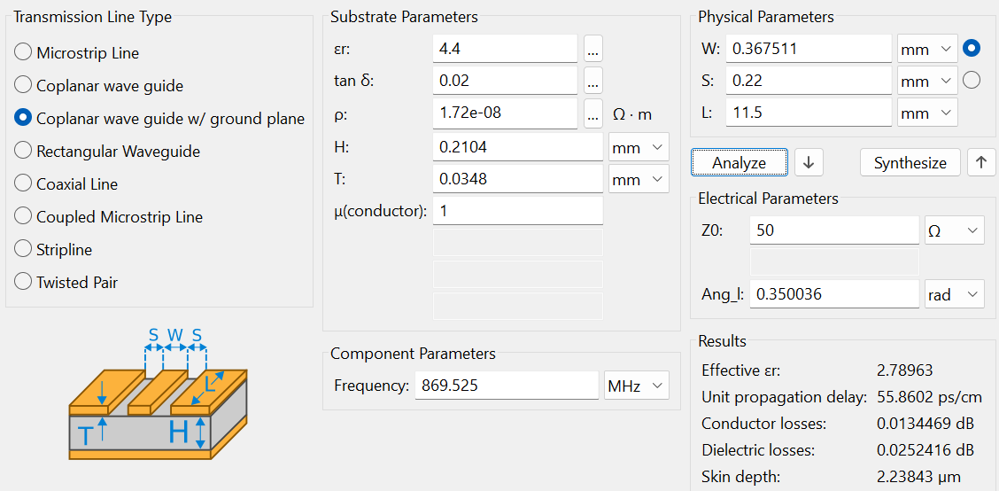</p>

In the signal trace, a T-matching network is included to be able to match the antenna's impedance to 50 Ohms. When no matching is used, a 0 Ohms resistor has to be connected in series and the parallel component has to be left open. More informations about antenna matching can be found in the [user manual](user_manual.md).

### USB UPDI Programmer

On the onboard and motherboard PCBs, onboard UPDI programmers and USB-UART bridges with USB-C connectors are included. 

The following image shows the general schematic:

<p align="center">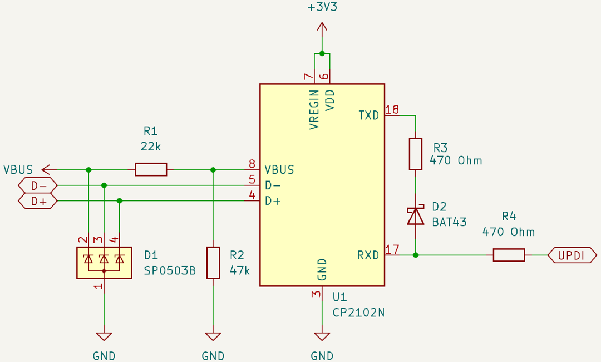</p>

The design features a CP2102N USB to UART bridge, [whose datasheet](https://www.silabs.com/documents/public/data-sheets/cp2102n-datasheet.pdf) suggests the use of an ESD protection diode (D1) for the data lines, and a voltage divider (R1, R2) for the `VBUS` input.
Not shown in the schematic is one LED (with a 560 Ohms resistor) each at `TXT` and `RXT` and decoupling capacitors (4.7 uF and 0.1 uF) at the `VREGIN` and `VDD`.

The UART to UPDI connection is based on [this guide](https://github.com/SpenceKonde/AVR-Guidance/blob/master/UPDI/jtag2updi.md). It features a Schottky diode and two protection resistors.

### Staggered Pin Rows / Lock Pattern

The onboard electronics feature a total of four stackable pin headers used to connect all subsystems of the rocket flight computer to a PCB stackup. Without precise alignment, the stacking of multiple PCBs is impossible.<br>
To fullfill this requirement, we use high-quality [Samtec ESQ pin sockets](https://www.digikey.de/de/products/detail/samtec-inc/ESQ-108-13-G-S/1766188) and a staggered pin layout inspired by an old [Sparkfun article](https://web.archive.org/web/20241202225923/https://www.sparkfun.com/tutorials/114), which is only available on the Wayback Machine nowadays.

The pins are staggered to guarantee perfect alignment. A shift by 1/10" or 0.254 mm and a hole size of 1 mm is perfect for the Samtec ESQ pin sockets. The result looks like this:

<p align="center"></p>

## Groundstation Electronics Casings

Plastics enclosures for the motherboard and daughterboards, each with a bottom part, a shell, and an acrylic cover. The repository includes all the original Fusion and auxiliary (`.step`, `.stl`) design files.

|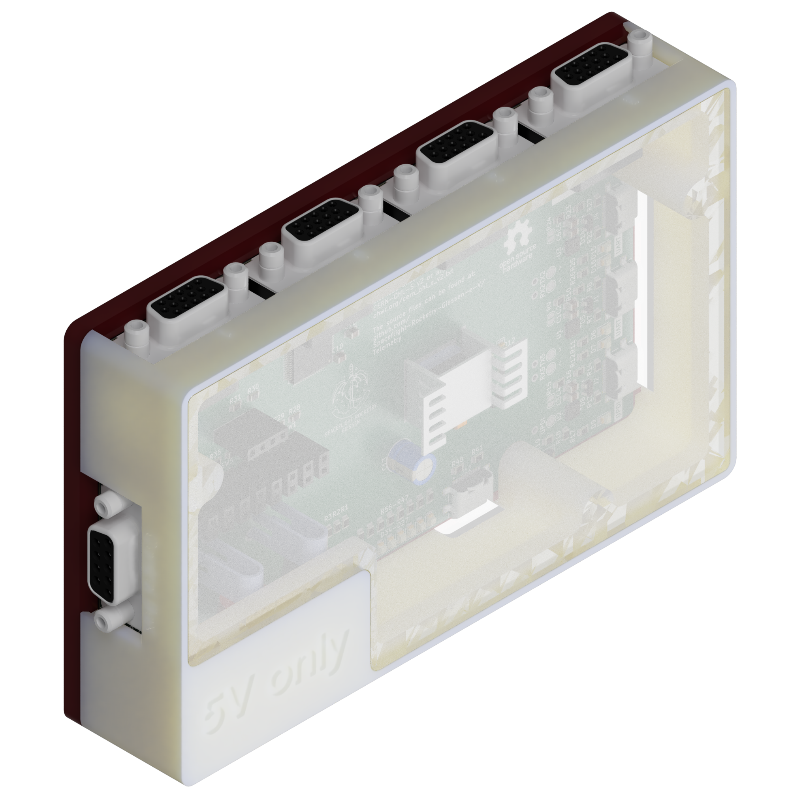||
|:---:|:---:|
|[Motherboard Casing](/groundstation/casing/Motherboard/)|[Daughterboard Casing](/groundstation/casing/Daughterboard/)|

## Onboard Electronics Mounting Structure

Attachment for onboard pcb, onboard QFH antenna and attachment point inside the rocket. Designed with generative design. The original and auxiliary design files can be found [here](../onboard/mounting%20structure/)

<p align="center"></p>

---

# Firmware

The firmware structure may be seen in the image below.

<p align="center"></p>

In the setup function, pin declarations and starting conditions are established. The radio module is initialized, and the desired configurations are applied after a configuration reset. Additionally, the flight computer initializes the I2C connection to the other subsystems of the flight computer (such as sensorics) and the ground station initializes the UART connection to the ground station computer.

In the loop function, radio commands (such as ping, toggle flight mode, toggle low power mode) are exchanged and data from the subsystems is collected and also exchanged. The available radio commands are listed in the [operations cheatsheet](operations_cheatsheet.md). 

## Data Budget \& Packet Structure

To achieve the highest possible range, we opted to use a low data rate, specifically 1.2 kbps. As a compromise between sampling rate and packet size, we chose a sampling rate of 10 Hz, resulting in 120 bits or 15 bytes per packet. Since the data link should not operate at full capacity, we allocate a buffer of 20%, leading to a final packet size of 12 bytes.

The structure of each packet with its components is described [here](package_structure.md).
<p align="center">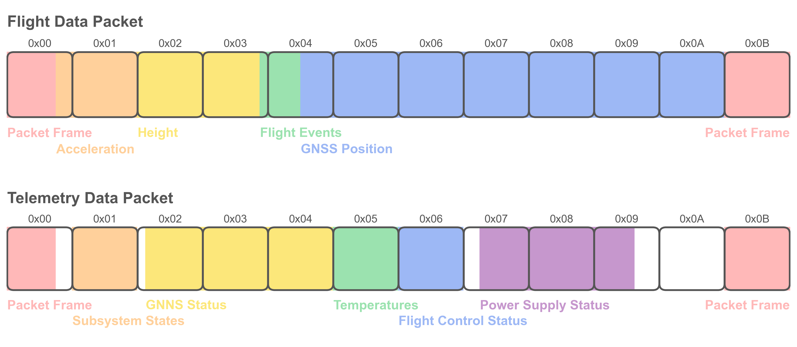</p>

To consider the 10 % duty cycle, the flight computer usually only transmits once every few seconds (the rate can be configured). The module starts to transmit continuously when the flight mode is toggled by a radio command. After a preset time, the continuous transmission stops and the standby transmission once every few seconds starts again.

## Libraries

### Radio Module Library

To ensure high modularity and a clean codebase, we created a RC1780HP-RC232 code library, which can be found [here](../common/libraries/Radiocrafts_RC17xxHP_RC232/) together with its documentation. The library includes functions for configuring the module, read sensor data and reset the module.

The library does not allow the use of all the functions of the radio module but focuses only on the ones needed for our project. However, the included functions can be easily adapted for other uses. It can also easily be adapted for other radio modules like the RC1180HP-RC232.

### Packet Encoding/Decoding Library

The encoding and decoding of packets according to our [packet structure](packet_structure.md) is handled by a dedicated library, which can be found [here](../common/libraries/Packet/) along with its documentation. It can again be adapted easily for other data structures.

---

# Antennas

Previously, we only used dipole stick antennas ([Linx ANT-868-CW-HW-SMA](https://www.digikey.de/en/products/detail/te-connectivity-linx/ANT-868-CW-HW-SMA/5592340)) for our telemetry system. Currently, we develop own antennas to be able to adapt them to our specific needs. Our plan is to use a QFH antenna with an omnidirectional radiation pattern on the flight computer and a directional helical antenna on the ground side.

## Groundstation 869 MHz Helical Antenna

### Geometric Design

We have included a separate [Helical Antenna Design Guide Python Notebook](/docs/helical_antenna_design_guide.ipynb). It describes the design process based on [this paper](https://bpb-us-e1.wpmucdn.com/sites.gatech.edu/dist/4/463/files/2015/06/HelixAPMagazineSubmission.pdf?bid=463) and the necessary calculations. There is also a Fast-Track calculation which approximates the calculations and needs only the frequency $f$, the wire radius $r$ and the ratio of length to circumference $\frac{L}{C}$.

More informations about helical antennas can be found [here](https://www.microwaves101.com/encyclopedias/helix-antennas) and [here](https://jcoppens.com/ant/helix/index.en.php).

The general process follows these steps:
1) Specify absolute circumference based on $\frac{L}{C}$
2) Specify pitch angle based on $\frac{L}{C}$
3) Calculate all other parameters and estimate the gain

The following table summarizes the geometric parameters of our helical groundstation antenna: 

| Parameter | Symbol | Value |
| --- | --- | --- |
| Frequency | f | 869.525 MHz |
| Wavelength | λ | 344.7773 mm |
| Circumference | C | 344.7773 mm |
| Diameter | D | 109.7460 mm |
| Radius | R | 54.8730 mm |
| Length | L | 480.1482 mm |
| Pitch angle | α | 6.0° |
| Pitch distance | d | 36.2376 mm |
| Turns | N | 13.25 |
| Wire radius | r | 3 mm |
| Wire length | l | 4.618 m |

The antenna has a gain of $G = 16.5\,\mathrm{dBi}$.

### Mechanical Design

To realise this long antenna design, some kind of fixature is necessary since the copper pipe would otherwise act as a spring.

As a central support, we use a 31 mm wide glass fiber rod. With epoxy resin, we attach a 3D printed support structure called pacifier every 1.75 turns. The prewound copper pipe can be wound through the pacifiers, which then leads to a supported structure.

The glass fibre rod sticks through the 40 cm round aluminium ground plane and is held in place by two cone shaped 3D printed support structures, attached with epoxy resin to the GFK rod. The cones are in turn attached to each other with eight M6 bolts through the ground plane. There is a fixture included in the bottom cone which attached to a camera tripod.

The following image shows the groundplane, the upper cone support, the GFK rod, the pacifiers and the copper cable:

| 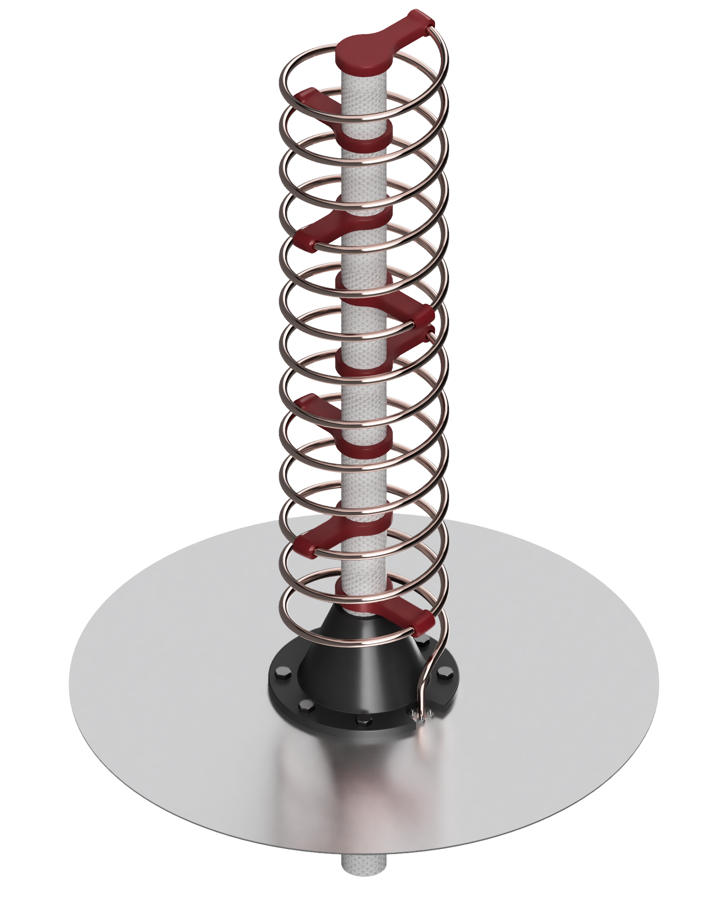| 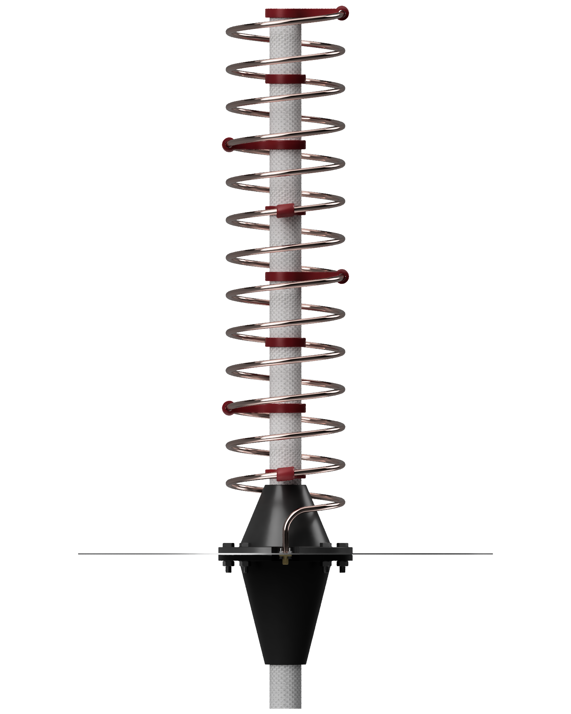 | 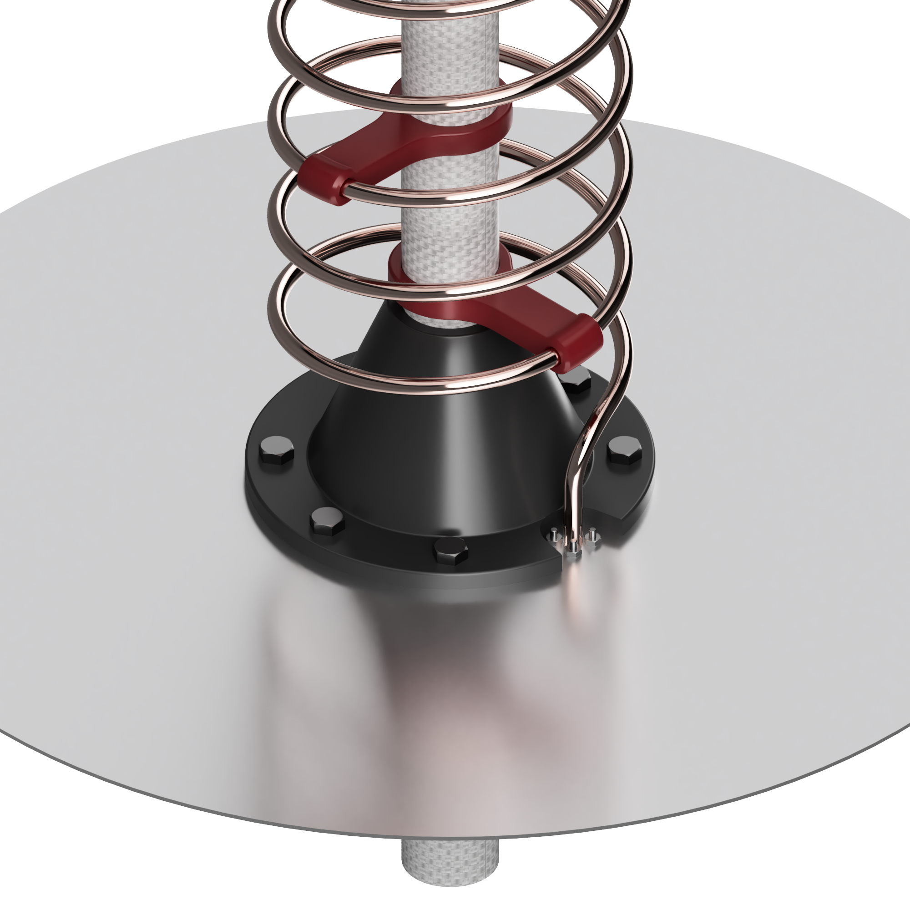 |
|---|---|---|

The assembly informations can be found in the [user manual](user_manual.md).

The winding help is a mould for shaping the copper wire. Since the wire expands a bit after winding, we decreased the size of the winding help by 3 %, leading to a diameter $D = 106.4536\,\mathrm{mm}$.

### Simulations

<p align="center"></p>

The simulations are based on the Finite-Difference Time-Domain (FDTD) method provided by the [openEMS software](https://github.com/thliebig/openEMS-Project). This allows us to look at the performance of the antenna nefore we build it and home in during the design process regarding the geometry.

### Previous Design

Before the design process of the new helical antenna, we designed and built a much larger version, featuring a 1.5 m helix and a 70 cm x 70 cm x 2 mm ground plane. The resulting antenna was too large, heavy and expensive, which is why we settled on a 0.5 m helix with a round 40 cm x 1.5 mm ground plane. The new antenna can easily be mounted on a camera tripod.

<p align="center"></p>

## Groundstation 169 MHz Dipole Antenna

The groundstation antenna for the 169 MHz radio system consists of a simple [dipole antenna](https://www.digikey.de/de/products/detail/joymax-electronics/VHX-362BSA1B/27545755) with an aluminum reflector.

A male-to-male panel-mount sma connector connects the coaxial cable, the reflector and the dipole antenna.

|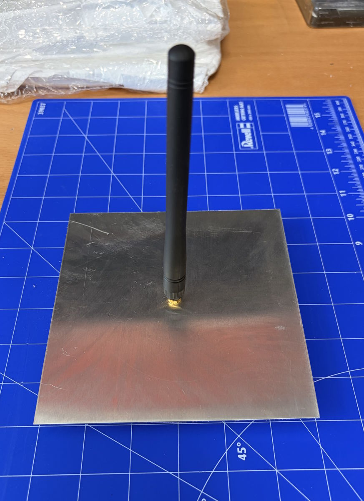|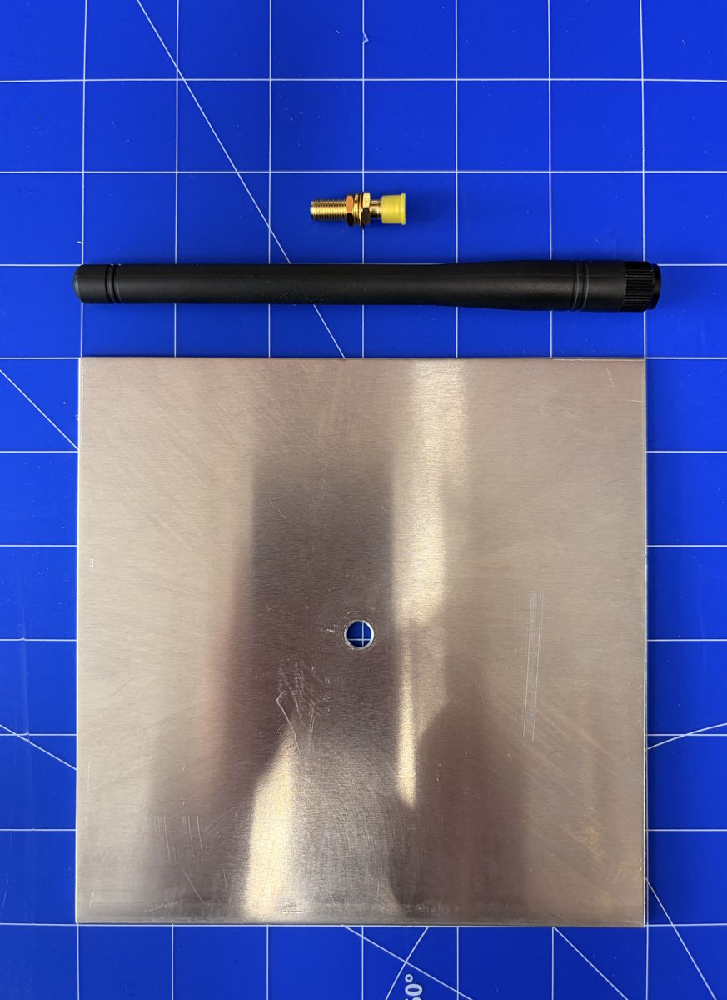|
|---|---|

## Onboard 869 Mhz QFH Antenna

> Informations will be added. See [#43](/../../issues/43)

### Geometric Design

Many resources on antennas: [antenna-theory.com](https://www.antenna-theory.com/)

Information on QFH antennas: [jcoppens.com](https://jcoppens.com/ant/qfh/index.en.php)

Information on connecting QFH antennas: [jcoppens.com](https://jcoppens.com/ant/qfh/adapt.en.php)

### Mechanical Design

### Simulations

---

# GUI software

The ground station GUI is a desktop telemetry dashboard for monitoring a flight in
real time. It is written in Python and built on [DearPyGui](https://github.com/hoffstadt/DearPyGui),
an immediate-mode GUI framework. The application reads the decoded telemetry stream
from the ground station receiver over the serial (UART) link, visualises it across a
set of live windows, logs everything to disk, and lets the operator send radio
commands back to the flight computer. The code lives in [/groundstation/gui/](/groundstation/gui/);
see its [README](/groundstation/gui/README.md) for setup and run instructions.

<p align="center"></p>

## Architecture

The application is started from [main.py](/groundstation/gui/main.py), which hands off to
the `UIManager` (`ui/ui_manager.py`). The `UIManager` builds the DearPyGui viewport,
instantiates every window, and acts as the central dispatcher for incoming telemetry.

Telemetry ingestion is handled by a `TelemetryReceiver` (`telemetry/com_controller.py`)
running on a background daemon thread. It reads the serial port line by line, matches
each line against a set of per-field regular expressions, and assembles a complete
packet once all expected fields have arrived. Completed packets are pushed to
`UIManager.update_all()`, which fans the individual fields out to the relevant windows.

All thresholds, labels and command definitions are kept in a JSON file
(`ui/settings.json`) managed by a `SettingsManager`. Values are accessed by
dot-notation (e.g. `battery.voltage_min`) and can be changed at runtime through the
Settings tab, with edits written back to disk immediately.

The GUI is single-window with two tabs. Several background threads run alongside the
main DearPyGui loop: the serial receiver, a map tile-fetch worker pool, and (optionally)
an air-traffic poller for the map overlay.

## Flight Data Tab

The Flight Data tab is the operational view and arranges the live windows in columns:

| Window         | Purpose                                                                                                                                                             |
| -------------- | ------------------------------------------------------------------------------------------------------------------------------------------------------------------- |
| COM Controller | Select the serial port and baud rate and start/stop the telemetry receiver.                                                                                         |
| Commands       | Send radio commands (ping, flight mode, low power, parachute/main chute) with a two-step confirm/abort flow so nothing is sent by a single misclick.                |
| Last Packet    | Read-only table showing the latest decoded value for every telemetry field.                                                                                         |
| Flight Events  | Sequential, colour-coded event list (pending → done → abort) driven by the packet status field.                                                                     |
| Battery        | Voltage progress bar with an under-voltage warning against configurable thresholds.                                                                                 |
| Connection     | RSSI signal-quality bar with a red→yellow→green gradient and a weak-signal warning.                                                                                 |
| Altitude       | Live plot of barometric (pressure) and GNSS altitude with min/max/current statistics and stop/resume/reset controls.                                                |
| Acceleration   | Live acceleration plot in g, with min/max/current and sample-to-sample delta statistics.                                                                            |
| Time           | Mission clock shown in three time zones (Germany, Portugal, US East).                                                                                               |
| Map View       | Interactive OpenStreetMap view with live GPS track, pan/zoom, follow-the-rocket centring, cached tiles, and an optional live air-traffic overlay (OpenSky Network). |
| GPS Location   | Current coordinates in both decimal degrees and degrees/minutes/seconds.                                                                                            |

## Settings Tab

The Settings tab exposes the contents of `settings.json` as editable fields, so the
operator can tune the dashboard without leaving the application. Changes are persisted
immediately. The configurable sections are:

| Section         | Controls                                       |
| --------------- | ---------------------------------------------- |
| `battery`       | Minimum, maximum and critical voltage          |
| `connection`    | RSSI minimum, warning and maximum              |
| `flight_events` | Event labels and the abort threshold           |
| `commands`      | Command groups, button labels and serial codes |

## Data Flow & Logging

A packet travels from the hardware to the screen as follows:

```
Receiver hardware (UART)
    - TelemetryReceiver: read line, regex-match fields, assemble packet
    - UIManager.update_all(packet): dispatch fields to windows
    - individual windows: altitude, acceleration, battery, connection,
      map/GPS, flight events, last-packet table
```

Every session is logged to disk under `groundstation/gui/logs/`: a `.txt` file
captures the raw serial lines with timestamps, and a `.csv` file records one row per
complete packet for post-flight analysis.
