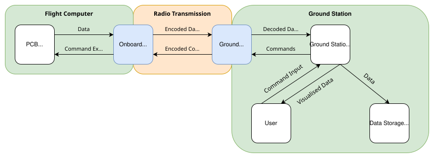
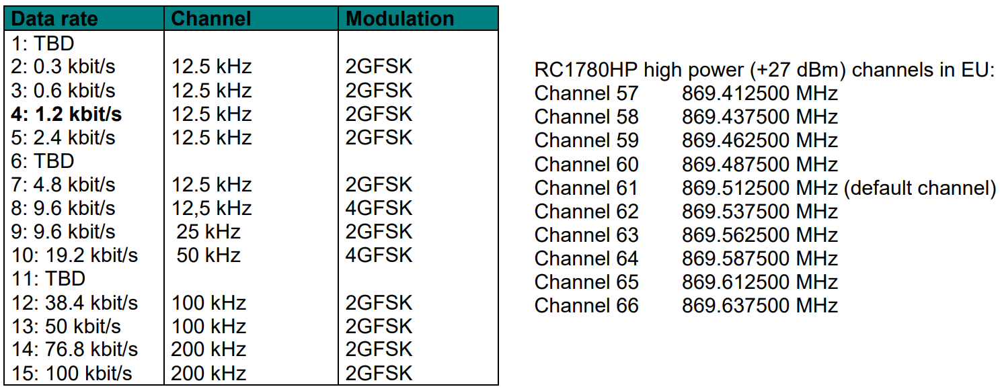
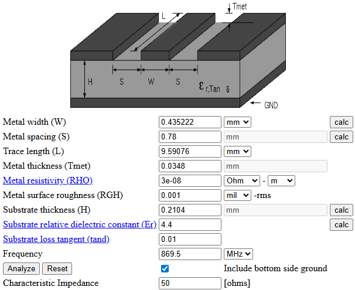
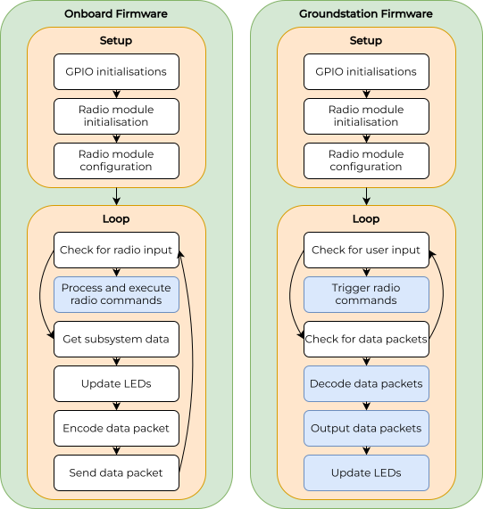

# Design overview

This document provides detailed information about our electronics, firmware, antenna, and GUI systems. It also covers rationales used during the design process.

The whole system is designed for an effective range of 18 km. To accomplish this goal, the signal strength at the receiver must be strong enough to be processed. Our link budget calculation as outlined in [this document](linkbudget.md) ensures that our system meets this requirement.

## Electronics

**Please note:** So far, the ground station and the flight computer use the same electronics hardware. We plan to develop dedicated ground station hardware in the future.

### Radio frequency

The license-free frequency bands in Germany are regulated by the Bundesnetzagentur. Frequencies between 100 MHz and 2400 MHz are of primary interest to us. The relevant regulations can be found in the ["Allgemeinzuteilungen von Frequenzen"](https://www.bundesnetzagentur.de/DE/Fachthemen/Telekommunikation/Frequenzen/Allgemeinzuteilungen/start.html). In this case the regulation of SRD devices applies. The frequency band between 869.40 MHz and 869.65 MHz can be used with an output power (EIRP) of up to 27 dBm or 500 mW, with a duty cycle of 10 %. This limits the radio transmission to 6 minutes total per (continous) hour.

### Radio modules

We chose the Radiocrafts RC1780HP-RC232 radio modules, which operate at frequencies from 869.41 MHz to 869.64 MHz and can achieve output powers of up to 27 dBm. The operation is straightforward due to the UART interface. The datasheet can be found [here](https://radiocrafts.com/uploads/RC17xxHP-RC232_Datasheet.pdf). Additionally, there is a separate manual for the RC232 series of radio modules that includes all configuration commands and more information, available [here](https://radiocrafts.com/uploads/RC232_user_manual.pdf). Application notes can be downloaded [here](https://radiocrafts.com/resources/document-library/?rs=Application%20Notes).

The following image shows the available data rates and high power (27 dBm) radio channels of the RC1780HP-RC232 module. The information is taken from the official datasheet.

### Microcontroller

We use the AVR128DB64 microcontroller in the 64-pin LQFP version ([datasheet](https://ww1.microchip.com/downloads/en/DeviceDoc/AVR128DB28-32-48-64-DataSheet-DS40002247A.pdf)). It offers a decent improvement compared to beginner-friendly Arduino boards, while still being easy to use. The [AVR DB Arduino Core (DxCore)](https://github.com/SpenceKonde/DxCore) offers excellent firmware and hardware documentation.

The following image shows the pinout of the AVR128DB64 MCU and is taken from the DxCore documentation:

### PCB design

The electronics design (schematic and pcb) was done with the open source EDA software KiCad. We included the KiCad project with all necessary files.

The following image shows the onboard pcb:

The onboard PCB is based on the standard layout of our rocketry club, featuring a round design with a diameter of 10 cm and a flattened edge with space for cables. Power and data are distributed via stackable pin headers located on the left and right sides. Generally, cheap stackable headers which can be found on eBay or Aliexpress can be used. We opted to use Samtec ESQ due to their superior quality. An I2C connection is used for communication with other subsystems to gather sensor data and forward radio commands.

During the pcb design process, we considered the Radiocrafts [RF PCB Layout Recommendation Application Note](https://radiocrafts.com/uploads/AN061_RF_PCB_Layout_Recommendations.pdf) and a [RF PCB Design Guide](https://www.proto-electronics.com/blog/routing-guidelines-rf-pcb). The PCB has a basic 4-layer stackup intended to reduce electromagnetic interference:
1) Components, signal traces, 50 Ohm RF trace
2) Continous ground plane
3) 5 V and 3.3 V power plane
4) Ground plane, signal traces 

Around the edge of the PCB, an exposed ground strip is included, connected by many vias to the solid ground plane (layer 2). The intend is to contain any electromagnetic emissions.

There are three types of traces commonly used as RF signal traces: microstrip, stripline, and coplanar waveguide. For all types, there are several online calculators to obtain the correct strip width to have a characteristic impedence of 50 Ohms. We use a coplanar waveguide and [this calculator](https://wcalc.sourceforge.net/cgi-bin/coplanar.cgi), which looks like this in our case:

Some PCB properties like Tmet, RHO, RGH, H, Er, and tand cannot be changed and depend on the PCB manufacturer. JLCPCB lists some parameters like Tmet, H, and Er in [this document](https://jlcpcb.com/impedance). For the other parameters, we used standard values.

Our goal was to calculate the trace width based on S and L. It is as valid to calculate S based on W and L.

In the signal trace, a T-matching network is included to be able to match the antenna's impedance to 50 Ohms. When no matching is used, a 0 Ohms resistor has to be connected in series and the parallel component has to be left open. More informations about antenna matching can be found in the [user manual](user_manual.md).

### LEDs

Both the onboard and groundstation PCB include each 1 status LED, 1 RGB LED and 4 debug LEDs.

The use of the groundstation's LEDs is described in the [operations cheatsheet](operations_cheatsheet.md).

The use of the onboard LEDs is the following:
- The status LED D1 is lit continuously in setup and blinks during loop. 
- The RGB LED shows the status of the connected subsystems. If all subsystems are responding via I2C, the LED glows blue. If all subsystems communicate a "good" state, the LED glows green. Else, it glows red.
- D5 is lit when the flight mode is active
- D6, D7 and D8 are used to indicate the detailed status of up to three subsystems. If a subsystem is responding via I2C, the respective LED blinks. If it communicates the "good" state, the LED is lit continuously. Else, it is not lit.

### USB UPDI Programmer

On our next-generation PCBs, an onboard UPDI programmer with an USB-C connector will be included. 

The following image shows the general schematic:

The design features a CP2102N USB to UART bridge, [whose datasheet](https://www.silabs.com/documents/public/data-sheets/cp2102n-datasheet.pdf) suggests the use of an ESD protection diode (D1) for the data lines, and a voltage divider (R1, R2) for the `VBUS` input.
Not shown in the schematic is one LED (with a 560 Ohms resistor) each at `TXT` and `RXT` and decoupling capacitors (4.7 uF and 0.1 uF) at the `VREGIN` and `VDD`.

The UART to UPDI connection is based on [this guide](https://github.com/SpenceKonde/AVR-Guidance/blob/master/UPDI/jtag2updi.md). It features a Schottky diode and two protection resistors.

## Firmware

### General

The firmware structure may be seen in the image below.

In the setup function, pin declarations and starting conditions are established. The radio module is initialized, and the desired configurations are applied after a configuration reset. Additionally, the flight computer initializes the I2C connection to the other subsystems of the flight computer (such as sensorics) and the ground station initializes the UART connection to the ground station computer.

In the loop function, radio commands (such as ping, toggle flight mode, toggle low power mode) are exchanged and data from the subsystems is collected and also exchanged. The available radio commands are listed in the [operations cheatsheet](operations_cheatsheet.md). 

### Data budget and packet structure

To achieve the highest possible range, we opted to use a low data rate, specifically 1.2 kbps. As a compromise between sampling rate and packet size, we chose a sampling rate of 8 Hz, resulting in 150 bits or 18.75 bytes per packet. Since the data link should not operate at full capacity, we allocate a buffer of over 10%, leading to a final packet size of 15 bytes.

The structure of each packet with its components is described [here](package_structure.md).

To consider the 10 % duty cycle, the flight computer usually only transmits once every few seconds (the rate can be configured). The module starts to transmit continuously when the flight mode is toggled by a radio command. After a preset time, the continuous transmission stops and the standby transmission once every few seconds starts again.

### Radio module library

To ensure high modularity and a clean codebase, we created a RC1780HP-RC232 code library, which can be found [here](../common/lib/RC1780HP/) together with its documentation. The library includes functions for configuring the module, read sensor data and reset the module.

The library does not allow the use of all the functions of the radio module but focuses only on the ones needed for our project. However, the included functions can be easily adapted for other uses. It can also easily be adapted for other radio modules like the RC1180HP-RC232.

### Packet encoding/decoding library

The encoding and decoding of packets according to our [packet structure](packet_structure.md) is handled by a dedicated library, which can be found [here](../common/lib/Packet/) along with its documentation. It can again be adapted easily for other data structures.

## Antennas

### General

So far, we only use [dipole stick antennas](https://www.digikey.de/en/products/detail/te-connectivity-linx/ANT-868-CW-HW-SMA/5592340) for our telemetry system. In the future, we plan to design and build our own antennas to be able to adapt them to our specific needs. Our plan is to use a QFH antenna with an omnidirectional radiation pattern on the flight computer and a directional helix antenna on the ground side.

### Antenna design

Many resources on antennas: [antenna-theory.com](https://www.antenna-theory.com/)

Information on QFH antennas: [jcoppens.com](https://jcoppens.com/ant/qfh/index.en.php)

Information on connecting QFH antennas: [jcoppens.com](https://jcoppens.com/ant/qfh/adapt.en.php)

Information on helical antennas: [jcoppens.com](https://jcoppens.com/ant/helix/index.en.php)

Article on helical antennas: [Link](https://www.microwaves101.com/encyclopedias/helix-antennas)

Paper on helical antenna design: [Link](https://bpb-us-e1.wpmucdn.com/sites.gatech.edu/dist/4/463/files/2015/06/HelixAPMagazineSubmission.pdf?bid=463)

## GUI software
