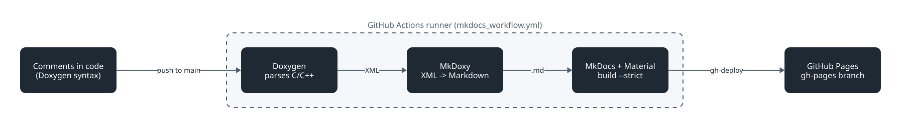

# Updating Pipelines Guide

This document provides an overview of the automated GitHub Actions workflows and the manual processing pipelines used when updated parts of this project. It is meant as an internal guide but can also provide support when contributing to or working on the project.

# Table of Contents

- [Automatic](#automatic)
   - [Firmware Documentation](#firmware-documentation)
- [Manuell](#manuell)
   - [Updating PCBs](#updating-pcbs)
   - [Updating CAD Models](#updating-cad-models)
   - [Updating Libraries](#updating-libraries)

# Automatic

## Firmware Documentation

The firmware documentation workflow automatically builds and publishes the API documentation for the onboard firmware, ground-station firmware, and libraries. The documentation is generated from comments and declarations in the C/C++ source files.

The source code uses Doxygen comment syntax to provide structured information about functions, classes, and data structures. A documentation block starts with `/**` and is placed directly before the declaration it describes. Doxygen commands beginning with `@` identify the purpose and individual parts of the API:

- `@brief` provides a short summary.
- `@param` describes a function parameter.
- `@return` describes the return value.
- `@defgroup` creates a documentation group.
- `@ingroup` assigns a declaration to a group, such as `onboard` or
  `groundstation`.

For example:

```cpp
/**
 * @brief Reads the latest command from the USB serial interface.
 *
 * @param serialUSB Serial interface used to receive the command.
 * @return The received command value.
 * @ingroup groundstation
 */
uint8_t commandReceive(HardwareSerial *serialUSB);
```

During the workflow, Doxygen converts these comments and the associated C/C++ declarations into Markdown/HTML files. 
<p align="center"></p>


The workflow runs after a push to the `main` branch when files in one of the following locations change:

- [`onboard/firmware/`](/onboard/firmware/)
- [`groundstation/firmware/`](/groundstation/firmware/)
- [`libraries/`](/libraries/)
- [`.github/mkdocs/`](/.github/mkdocs/)
- [`.github/workflows/mkdocs_workflow.yml`](/.github/workflows/mkdocs_workflow.yml)

The GitHub Actions job performs these steps:

1. Checks out the repository and configures the GitHub Actions bot as the Git user.
2. Installs Python 3.12, Doxygen, MkDocs, Material for MkDocs, and MkDoxy.
3. Builds the complete documentation using the configuration in    [`.github/mkdocs/mkdocs.yml`](/.github/mkdocs/mkdocs.yml).
4. Runs the build in strict mode so that documentation warnings cause the job to fail instead of deploying an incomplete site.
5. Publishes the generated website to the [`gh-pages` branch](https://spaceflight-rocketry-giessen-e-v.github.io/Telemetry/).

The published firmware documentation is available at [spaceflight-rocketry-giessen-e-v.github.io/Telemetry](https://spaceflight-rocketry-giessen-e-v.github.io/Telemetry/). If another documentation workflow starts while one is already running, the older run is cancelled so that only the newest version is deployed.

# Manual

## Updating PCBs

When updating anything related to PCBs, work through the follwing steps:

1) Regenerate pdf schematic
2) Regenerate gerber files 
3) Zip the gerber files
4) Regenerate bom and ibom
5) Check if all renderings are still right

Please always check that no custom third party symbols, footprints or 3D models are included in the custom libraries. Instead, substitutions should be handcrafted (KiCad objects can be used as a starting point as stated [here](https://www.kicad.org/libraries/license/)). Please also remove unused symbols, footprints and 3D models.

## Updating CAD Models

When updating a CAD model in Autodesk Fusion, the `.f3d`/`.f3z` file should be used as the starting point. 

After the changes, the `.f3d`/`.f3z` file should be exported and placed in the `Original Design Files` folder. Also, every component should be exported separately as both `.stl` and `.step` files and both should be placed in the `Auxiliary Design Files` folder.

It should always be checked, if all renderings are still right even after the changes.

## Updating Libraries

When one of the libraries is updated, the version number in the `library.json` file has to be incremented. This project adheres to Semantic Versioning with MAJOR.MINOR.PATCH as the version number. Please see the [Semantic Versioning v2.0.0 Specification](https://semver.org/spec/v2.0.0.html) for details.

To publish the library to the [PlatformIO Library Registry](https://registry.platformio.org/), the PlatformIO Core CLI tool has to be used. First, open only the library folder in VS Code. Then, click the PlatformIO Icon in the side bar and go to `Miscellaneous` &rarr; `PlatformIO Core CLI`. Use `pio account login` to log in to the PlatformIO account and then use `pio pkg publish` to publish the new library version.