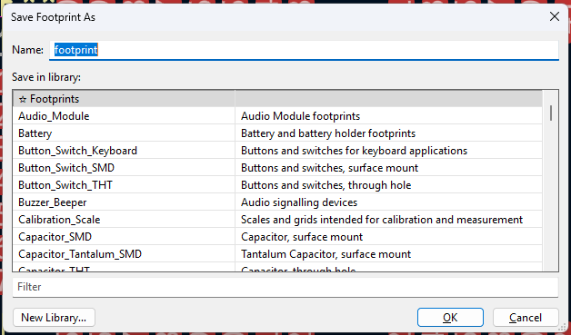
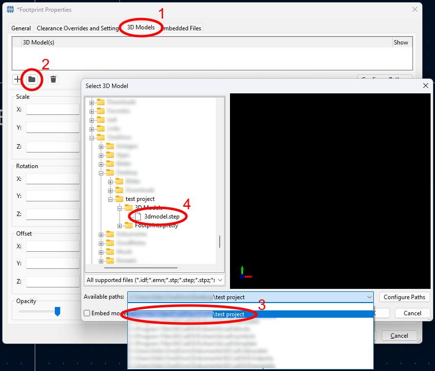
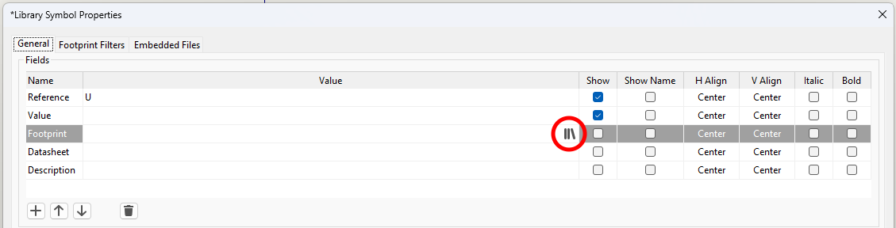
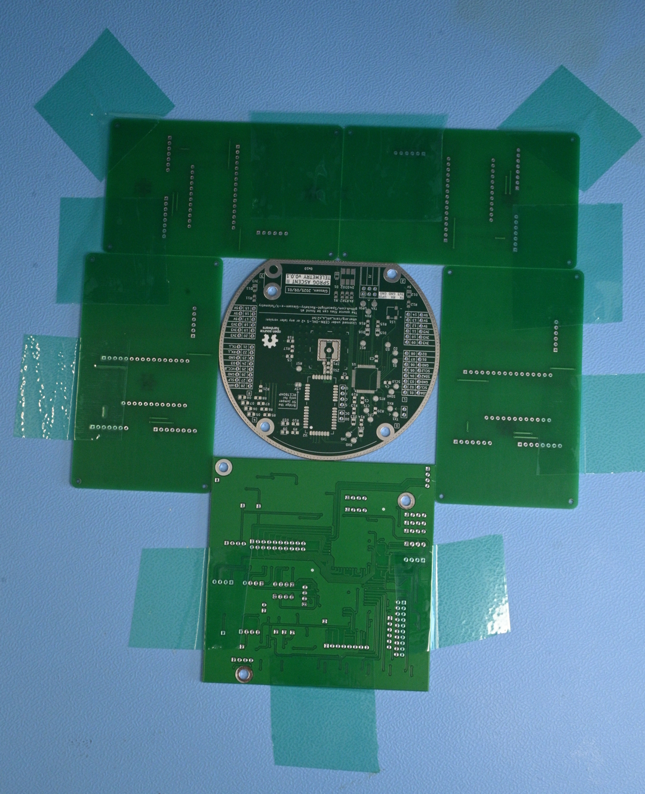
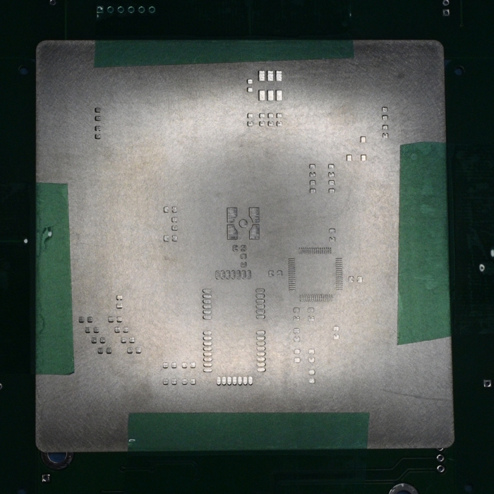
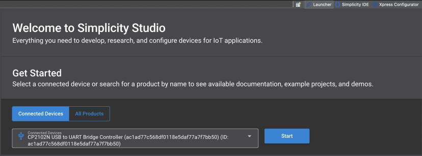
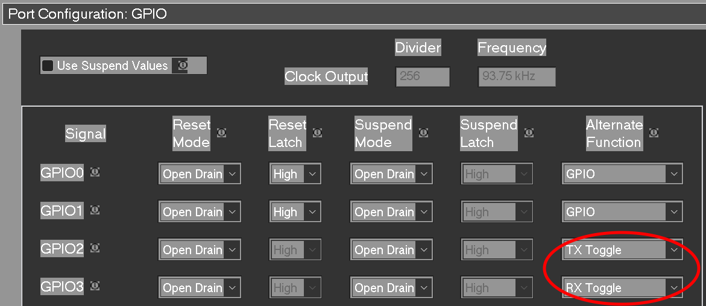

# ASCENT II Telemetry System User Manual

Please see the [operation advices](#operation-advices) before using the system!

- [Repository Usage](#repository-usage)
- [Electronics](#electronics)
    - [EDA Usage](#eda-usage)
    - [Ordering](#ordering)
    - [Assembly](#assembly)
- [Firmware](#firmware)
    - [IDE Usage](#ide-usage)
    - [USB-to-UART/UPDI bridge](#usb-to-uartupdi-bridge)
- [Antenna](#antenna)
    - [Assembly](#assembly-1)
    - [Measurements](#measurements)
    - [Impedance Matching](#impedance-matching)
- [Operation Advices](#operation-advices)
    - [Powering The System](#powering-the-system)
    - [Serial Communication](#serial-communication)
    - [Antenna Precautions](#antenna-precautions)

---

# Repository usage

The usual process for locally cloning the repository applies:
1. Install [Git](https://git-scm.com/install/)
2. Open the desired destination folder in the terminal
3. Clone the repository: `git clone https://github.com/Spaceflight-Rocketry-Giessen-e-V/Telemetry` 

---

# Electronics

The process is similar for the onboard and ground station systems.

## EDA Usage

### View and edit the schematic or PCB design files

Our electronics hardware is designed using the open source EDA KiCAD. The schematic and PCB design files can be viewed and  are editable. The schematic is also included in [PDF format](../onboard/pcb/TelemetryOnboard_Schematic.pdf).

### Add custom symbols, footprints and 3D models

The KiCAD project comes with included custom symbol and footprint libraries.
Additional symbols and footprints can be added to these libraries:

- Download the desired files. You can find them on Digikey, Traceparts, Snapmagic, or similar sites. They sould be .kicad_sym (symbol), .kicad_mod (footprint), .step (3D model).
- Put the 3D model in the "3D Model" directory in the same directory as the KiCAD project. The symbol and the footprint can remain in the download folder.

Include the footprint and link the 3D model:
- Open the footprint editor and go "File", "Import", "Footprint"
- Choose the footprint from the download folder
- Press "Save" and insert the desired name and choose the "Footprints" library:

- Press "OK"
- Press "E" to open the footprint properties
- Go to the "3D Models" tab (1), click the folder symbol (2), choose the project path (3), and choose the correcht 3d model (4)

- If the 3D model is not positioned correctly, it can be scaled, rotated, or moved
- Press "OK" and then "Save"

Include the symbol and link the footprint:

- Open the symbol editor, click the "Symbols" library, and go "File", "Import", "Symbol"
- Choose the symbol from the download folder
- Press "Save" and insert the desired name and choose the "Symbols" library
- Press "OK"
- Press "E" to open the symbol properties
- Hover over the "Footprint" field and click the library symbol:

- Choose the footprint from the "Footprints" library
- Press "OK" and then "Save"

## Ordering

### Sourcing PCBs
The PCBs can be sourced from any PCB manufacturing service like JLCPCB or PCBWAY. We included the [Gerber Production Files](../onboard/pcb/Production%20Files/Production%20Files.zip) in the repository. We recommend ordering a solder paste stencil as well, as it simplifies the soldering process.

### Sourcing components

We source most of our electronics components from Digikey. We included a [Bill of Materials](../onboard/pcb/TelemetryOnboard_BOM.csv) where a direct link to Digikey is provided. Most of the components are also available at similar sellers like Mouser. An [Interactive BOM](../onboard/pcb/TelemetryOnboard_Interactive_BOM.html) is also included to assist in placing the components.

## Assembly

### SMD component assembly

First, the surface mounted components are soldered. We recommend the Chipquik TS391LT lead free, thermally stable, no-clean, low temperature solder paste, which also comes at a reasonable price. 
To apply the solder paste, the PCB should be cleaned with isopropyl alcohol and then be fixated on a table using surplus PCBs and sticky tape as mechanical stop. 

Next, the solder paste stencil is exactly aligned and fixated with tape as well. 

A small amount of solder paste can be applied and spreaded out using a spatula or an old credit card. When completed, the stencil is removed and the components can be placed on the PCB with tweezers, starting with the smallest components.
We recommend using a hot plate like the Uyue 946C to melt the solder, but a hot air station or a reflow oven can also be used.
Bridged pins can be reworked with flux and a small tip on a soldering iron.

### THT component assembly

After the SMD components are soldered, the through hole mounted components can be soldered. by heating the part and the pad before adding the solder and using a bit of flux, good results can be obtained.

### PCB Cleaning

The PCB can be gently cleaned using a soft toothbrush and isopropyl alcohol. The thereby solved flux can be rinsed with isopropyl alcohol. An ultrasonic cleaner with distilled water can also be used and should be followed up by a complete drying process.

---

# Firmware

## IDE Usage

### View and edit the firmware

Our firmware is designed to be used with Visual Studio Code and the PlatformIO extension. The firmware folder of either the ground station or the onboard system can be directly opened in VSCode. 

### Upload the firmware

To upload the firmware to the system, an UPDI programmer like the Adafruit UPDI Friend is needed. The corresponding COM port has to be selected in VSCode in the status bar.

## USB-to-UART/UPDI bridge

Our newest PCB design features one CP2102N USB-to-UART bridge each for UPDI programming and UART debugging and data transfer.

### Drivers

To use the onboard USB bridge to program the microcontroller via UPDI and to transfer data via UART, the [CP210x VCP driver](https://www.silabs.com/software-and-tools/usb-to-uart-bridge-vcp-drivers?tab=downloads) has to be installed.

### LED Setting

By default, the LEDs are not configured to turn on during data transfer.

To configure this setting, the computer has to be connected with a USB cable to the desired chip and the [CP210x VCP driver](https://www.silabs.com/software-and-tools/usb-to-uart-bridge-vcp-drivers?tab=downloads) as well as the [Simplicity Studio 5 software](https://www.silabs.com/software-and-tools/simplicity-studio/simplicity-studio-version-5) have to be installed on the computer.
With the Simplicity Studio software, several settings can be changed, as outlined in the [SiLabs AN721 Application Note](https://www.silabs.com/documents/public/application-notes/AN721.pdf).

The following procedure has to be applied:
1) Open Simplicity Studio.
When opening for the first time, a new project has to be created: Press *Start* next to the connected device and create the project. 

2) Open the Xpress Configurator by pressing *Open Perspective* in the top right toolbar.
3) Import the current data from the device.
4) Under *Port Configuration GPIO*, change the *Alternate Function* of GPIO2 and GPIO3 to *TX Toggle* and *RX Toggle* respectively.

5) Save the changes and program to the device.

---

# Antenna 

## Assembly

### Helix Assembly

The assembly of the groundstation helix antenna is described in a [separate document](./helix_antenna_assembly_manual.md).

## Measurements

When measuring self-built or bought antennas, vector network analyzers (VNA) like the NanoVNA-H4 or the LiteVNA 64 are necessary tools and can be bought for cheap.

### Calibration

Before each measurement, the VNA has to be calibrated for the desired frequency range, which should be centered around the frequency of interest, in our case 869.5 MHz. For the measurement of the S11 parameter, the calibration procedure is the following:
1. Input the desired frequency range: STIMULUS -> START, STOP
2. Calibrate with the OPEN SMA connector (no pin in the middle): CALIBRATE -> OPEN
3. Calibrate with the SHORT SMA connector (pin in the middle, looks similar compared to OPEN): CALIBRATE -> SHORT
4. Calibrate with the LOAD SMA connector (pin in the middle, looks different compared to OPEN): CALIBRATE -> LOAD
The calibration data can be saved and used again.

The calibration should always be performed in the exact same way the antenna is tested afterwards. If a cable is going to be used between the VNA and the antenna, the same cable has to be used between the VNA and the OPEN/SHORT/LOAD connectors during calibration.

As an alternative, the length of the cable can also be accounted for in the VNAs software.

### Measurements

There is a range of measurements, which can be done with a VNA. [This article](https://www.antenna-theory.com/measurements/antenna.php) lists the many options.

The most interesting and most feasible measurement is an impedance measurement over a frequency range. An impedance missmatch causes power losses and should be compensated via impedance matching.
Here is a list of videos explaining [S-parameters](https://youtu.be/-Pi0UbErHTY?si=Z9UQJC-R-1Vzc-xW), [the Smith chart](https://youtu.be/TsXd6GktlYQ?si=DfGhaZ3w0biYOcfI) and the application of a VNA ([Video 1](https://youtu.be/rbXq0ZwjETo?si=DdEQ7rzXj86T0cxC) and [Video 2](https://youtu.be/91ZRTFZ40rw?si=-yBII5ZVjXriQ2fS)). [This video](https://youtu.be/l2c46uA50zg?si=s27nZCh-ScBlFWUF) also includes the comparison to a simple simulation software (4NEC2).

The measurement of the radiation pattern or the gain of an antenna is more sophisticated and introduces more errors, but can be done as well.

## Impedance Matching

Our current design includes a L-matching network to tune the antennas impedance to 50 Ohms. When no impedance matching is used, the ZS1 component should be a 0 Ohm resistor and the ZP1 component should be left open

There are many articles and videos explaining the impedance matching concept. [This video](https://youtu.be/OkPVlv4wVeY?si=Ta4NVOyTLGxH_oTO) and [this video](https://youtu.be/IgeRHDI-ukc?si=xvtN1C7xtP1WACcb) explain the matching network and matching technique used in our design, while [this article](https://www.electronicdesign.com/technologies/analog/whitepaper/21133206/back-to-basics-impedance-matchi) offers a general overview over the topic.

---

# Operation Advices

## Powering The System

For the system to be operational, both the 3.3 V and the 5 V lines have to be connected. Any of the respective positions on the pin sockets can be used. To allow the full output power with a safe margin, the power supply should be able to provide 1 A at 5 V and 0.5 A at 3.3 V.

Note: When using an external power supply, the 3.3 V lines of UPDI programmers or UART to USB adapters should never be connected.

## Serial Communication

For the serial communication with the system, an UART to USB adapter has to be used. When using the (planned) integrated USB circuit or an USB adapter based on the CP2102N, the [CP210x VCP driver](https://www.silabs.com/software-and-tools/usb-to-uart-bridge-vcp-drivers?tab=downloads) has to be installed.

We recommend using a dedicated serial monitor like the excellent project [Coolterm](https://freeware.the-meiers.org/), for which we included our [settings file](../groundstation/Coolterm_SerialMonitor_Settings.CoolTermSettings). The settings can be opened via "File" -> "Open".

## Antenna Precautions

The system should never be operational without a connected antenna, as otherwise the high output power can permanently damage the radio module.

If testing the radio communication between the onboard system and the ground station system, a distance of at least 1.5 m should always be established.