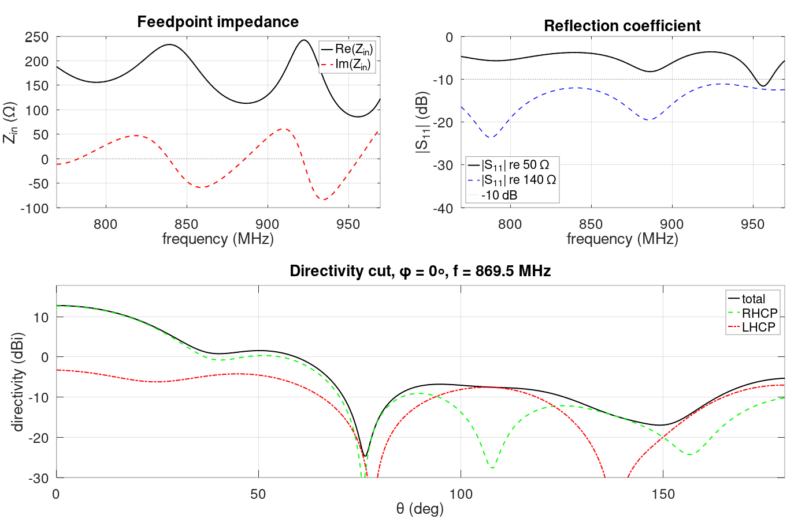
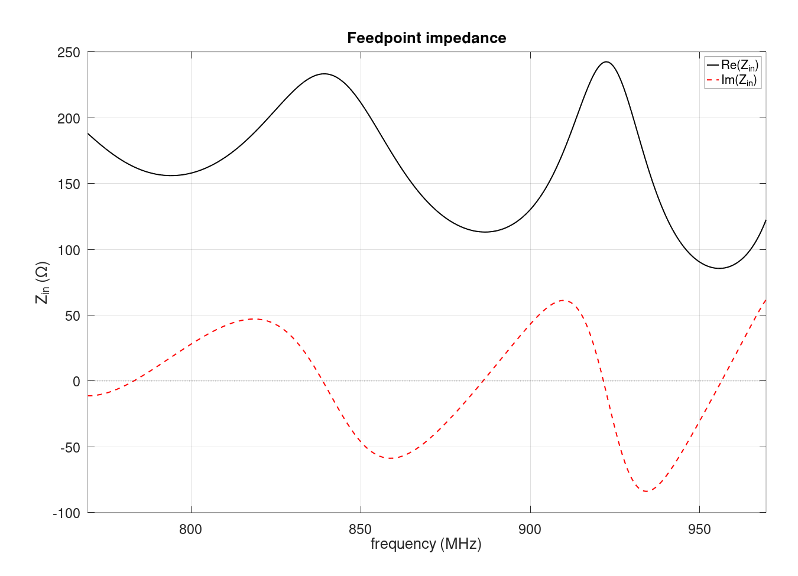
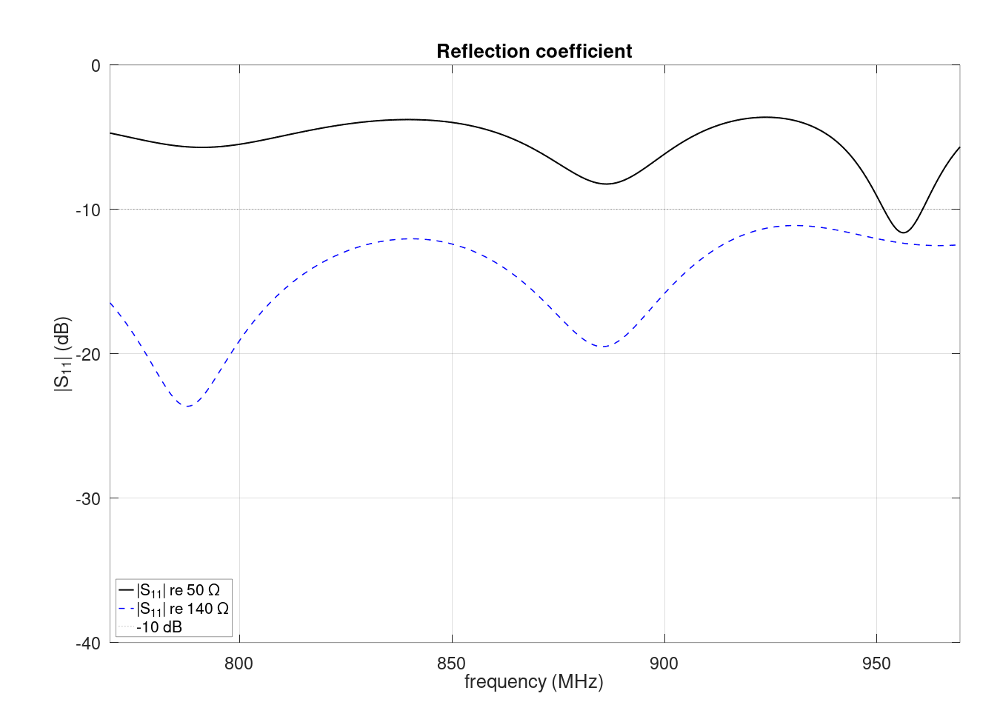
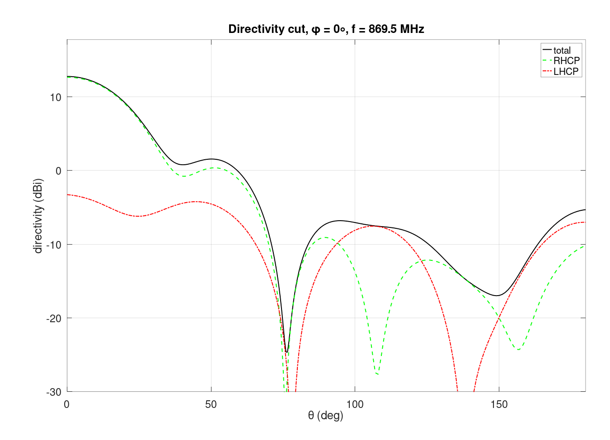

# Antenna Simulation with openEMS

## What is [openEMS](https://github.com/thliebig/openEMS-Project)
openEMS is an open source electromagnetic field solver which utilizes the **FDTD** method. **FDTD** stands for **Finite-difference time-domain** and is a way to discretize the problem and enables us to solve it via the help of computers. 

Antenna simulation is just one of the use cases for the solver. Check out the repository to get a better look at what it can do, and leave a star for the [repository](https://github.com/thliebig/openEMS-Project) to support the amazing work of Thorsten Liebig and the contributors.

## Why simulating
You could ask yourself why simulating and not just using an online tool, buying an already made antenna or trusting a paper/documentation.

With the **right** simulation you have full control over the system. You can change the parameters and see whether the rest of the system will work with the antenna, or whether there are performance degrading effects that need to be mitigated or worked around. An online calculator gives you one number from a closed formula — it cannot tell you what the reflector, the feed or the mounting structure will do to it.

With buying you get a working system but you lose the effect of learning and getting to know the system you are building. You also get the antenna somebody else optimised, for their frequency and their mounting situation, not yours.

With following a paper it is highly encouraged to not blindly trust it, without any form of proof that it is accurate. Rebuilding the geometry in a solver is a kind of proof: if the simulation and the paper agree, the design can be used. The best thing is to always validate what you have done against an outside source.

So the why is simple: simulating is the only one of these options that lets you ask "what happens if I change this?" and get an answer before anything is built. It costs an evening on a laptop instead of a part, a solder joint and a measurement session.

## To run the Simulation

Since the simulation is based on the Octave implementation of openEMS, we need to install **Octave** and **openEMS**.

Octave
-----
Go to the [Octave Wiki](https://wiki.octave.org/Category:Installation) or to the [download page](https://octave.org/download) for the Windows installation.

### Arch

```
pacman -S octave
```
### Windows
On the download page get the version that fits your system.


openEMS
-
Follow the guide [here](https://docs.openems.de/install/clone-build-install.html). Note that the docs tell macOS users to follow a dedicated tutorial — that one is currently broken, so install via the guide above instead.


## The antenna
The antenna is an axial-mode RHCP *(right-hand circular polarisation)* helix antenna for a frequency of $f=869.525\,\mathrm{MHz}$, with the following specifications
($\lambda_0 = c_0/f_0 = 344.78\,\mathrm{mm}$, all dimensions in mm as in the script):


## Setting up the simulation
The simulation we have is separated into 4 parts:
- build up the geometry
- simulate the antenna
- post-process the produced data
- display the data

In our code this is handled by these 4 use cases:

```matlab
disp('  [1] Full run       -- build, simulate, post-process');
disp(sprintf('  [2] Post-proc only -- re-use existing %s/ results', aux_dir_name));
disp('  [3] Geometry check -- open AppCSXCAD, then stop');
disp('  [4] Preview + run  -- geometry check first, then simulate');
```
A **Full run** has to be done to generate the data [2] re-uses. [3] and [4] build the geometry
themselves and need nothing beforehand.

### Where everything is written
The names are not hard-coded, they are derived from the script file at the top of it:

```matlab
[script_dir, script_name] = fileparts(mfilename('fullpath'));
aux_dir_name = 'Simulation_auxiliary_files';
Sim_Path = fullfile(script_dir, aux_dir_name);
Sim_CSX  = [script_name '.xml'];
```

So `Helical_Antenna.m` writes its geometry to `Simulation_auxiliary_files/Helical_Antenna.xml`, and
everything the run produces — field dumps, port data, figures, the VTK — lands in that same
`Simulation_auxiliary_files/` folder next to the script. Rename or copy the script and the XML
follows the new name, which keeps two variants from overwriting each other's geometry.
### Frequency and excitation
```matlab
f0 = 869.525e6;
fc = 100e6;
FDTD = InitFDTD('NrTS', 1e6, 'EndCriteria', 1e-5);
FDTD = SetGaussExcite(FDTD, f0, fc);
```

The antenna is not simulated at one frequency. It gets hit once with a short pulse and we watch it
ring down, which gives us the whole band in a single run — the same picture a VNA sweep gives you.

The two numbers set that band. `f0` is the **center**, `fc` is the **half-span** either side:

<div align="center">

| Parameter | Value |
|:---:|:---:|
| `fc` | 100 MHz |
| Excited band | 769.5 … 969.5 MHz |

</div>

**Changing `fc` changes the plot, not the antenna.** A wider span does not make the helix
broadband; it only widens the window you look through. What it does change is how long the run
takes, and it gets more expensive in *both* directions:

- **Smaller `fc` → longer simulation.** A narrow pulse in frequency is a long pulse in time, and
  the solver has to step through all of it. Halving `fc` roughly doubles that part of the run.
- **Larger `fc` → finer mesh.** The cell size is tied to the highest frequency in the pulse, so a
  wider span means smaller cells everywhere, and more of them.

100 MHz sits in the middle: cheap enough to run, wide enough to see the resonance move when a
parameter changes.

### Boundary conditions
```matlab
BC = {'PML_8' 'PML_8' 'PML_8' 'PML_8' 'PML_8' 'PML_8'};
FDTD = SetBoundaryCond(FDTD, BC);
```

Six faces, six absorbers. A **PML** swallows outgoing waves instead of reflecting them, so the box
behaves like open space.

`PML_8` is 8 cells thick, and those cells are **taken out of the box, not added around it** — so
the air gap has to pay for the PML *and* still leave real air between it and the antenna:

```matlab
air_gap = 0.75 * lambda0;   % 258.6 mm = 79.6 mm PML + 179 mm real air (0.52 lambda)
```

Keep the antenna at least λ/4 clear of the PML. Too close and it absorbs near-field energy that
should have stayed put, and `Zin` comes out wrong.

### The mesh
Two stages: fine lines where the geometry is, then graded out to coarse everywhere else.

```matlab
mesh.x = SmoothMeshLines([-Helix.radius 0 Helix.radius], Helix.mesh_res);  % 1.5 mm
mesh_x_tmp = [mesh.x, -gnd_size/2, gnd_size/2, -sim_r, sim_r];
mesh.x = AutoSmoothMeshLines(mesh_x_tmp, max_res, grade);                  % out to 10 mm
```

`SmoothMeshLines` puts 1.5 mm lines across the helix, `AutoSmoothMeshLines` grows them out to
`max_res` with no cell more than `grade = 1.2`× its neighbour. `max_res` is λ/30 at the *highest*
excited frequency, not at `f0` — `c0/(f0+fc)/30` = 309 mm / 30 → 10 mm. The ramp has to be
gradual — an abrupt size jump reflects waves off the grid itself.

Use `AutoSmoothMeshLines` for that second stage, not `SmoothMeshLines`: the plain version can
silently return a mesh that misses the grading ratio you asked for.

**The smallest cell sets the runtime**, because it caps the timestep. Halving
`mesh_res` costs 8× the cells *and* half the timestep — about 16× the run. Here: 167 × 167 × 396 =
**11.0 M cells** at 2.86 ps.

### Geometry: helix, ground plane, feed
**The helix** — the parametric equation of a coil, sampled into points and given a thickness:

```matlab
t = linspace(0, 2*pi*Helix.turns, pts*ceil(Helix.turns));
coil_x = Helix.radius * cos(t);
coil_y = Helix.radius * sin(t);
coil_z = (t/(2*pi)) * Helix.pitch + feed.height;   % rises one pitch per turn
CSX = AddWire(CSX, 'helix', 0, p, Helix.wire_rad);
```

`AddWire` gives the conductor a real 3 mm radius. `AddCurve` looks like the same thing but is a
zero-thickness filament, and it ignores a `'Radius'` argument without warning.

**The ground plane** — a 64-sided polygon standing in for a 400 mm disc:

```matlab
theta_gnd = (0:num_gnd_pts-1) * 2*pi/num_gnd_pts;   % NOT linspace(0, 2*pi, N)
```

`linspace(0, 2*pi, N)` would include both 0 and 2π — the same point twice — giving the polygon a
zero-length edge.

**The feed** — a lumped port up the 15 mm gap between ground plane and helix:

```matlab
[CSX, port] = AddLumpedPort(CSX, 5, 1, feed.R, start, stop, [0 0 1], true);
```

`feed.R = 140` because that is roughly what an axial-mode helix presents (Kraus: $140\,C/\lambda$).
It is only the reference that S11 is measured against, but a realistic one keeps the port matched so
the pulse goes into the antenna instead of bouncing. 50 Ω is compared later, in post-processing.

### NF2FF box
```matlab
start_nf = [mesh.x(11) mesh.y(11) mesh.z(11)];
stop_nf  = [mesh.x(end-10) mesh.y(end-10) mesh.z(end-10)];
```

The solver only knows the inside of the box, but a radiation pattern lives infinitely far away.
Recording the fields on a closed surface lets everything outside be computed from them — that
surface is the NF2FF box.

The indices are the point: `PML_8` uses 8 cells, so `11` / `end-10` keeps the box in real air, a
couple of cells clear of it (±359 mm inside a ±459 mm box). Fields inside the PML are being damped
on purpose, and feeding those to the transform gives a nonsense pattern.

## Running it
The menu at the top of the script sets three flags — `run_fdtd`, `show_geometry`, `do_postproc` —
and everything below just checks them:

| Mode | Does | Use it when |
|:---:|:---|:---|
| **1** Full run | build → simulate → post-process | the normal case |
| **2** Post-proc only | re-use `Simulation_auxiliary_files/` | replotting, tweaking a figure |
| **3** Geometry check | open AppCSXCAD, then stop | after changing dimensions |
| **4** Preview + run | look first, then simulate | changed geometry, ready to commit |

**Run mode 3 after every geometry change.** AppCSXCAD draws what the solver will actually see, so a
helix wound the wrong way or a feed that misses the coil is obvious in seconds instead of an hour.

### Threads
Modes 1 and 4 ask for a thread count before they start; modes 2 and 3 never solve, so they do not
ask. Press Enter for the default of 14, type a number, or type `auto`:

```matlab
RunOpenEMS(Sim_Path, Sim_CSX, ['--engine=multithreaded' thread_opt ' --dump-statistics']);
```

| Answer | `thread_opt` | Effect |
|:---|:---|:---|
| *(Enter)* | `--numThreads=14` | the default: 16 cores, two left for the desktop |
| `8` | `--numThreads=8` | fixed count, rejected if not a positive integer |
| `auto` | *(omitted)* | openEMS tunes it itself |

`auto` is not "use all cores". Leaving `--numThreads` off puts the multithreaded engine into a
self-tuning mode: it starts at **one** thread and adds another every statistics interval until the
measured speed stops improving, then backs off one and keeps that. It reports the result as
*"Multithreaded Engine: Best performance found using N threads."* Intervals are about 4 s here, so
the ramp costs roughly a minute — worth it if you do not know the right number, wasteful if you do.

Asking for more threads than you have only warns; openEMS clamps to `hardware_concurrency()` itself.

About **7 minutes** at 14 threads (11.0 M cells, 13 905 timesteps, 425 s at 3.6·10⁸ cells/s) on a AMD Ryzend 7800x3d. The
run stopped on `EndCriteria`, not on the 10⁶ timestep cap — energy was down to 5·10⁻¹⁸ from a
5·10⁻¹³ peak. Note mode 1 wipes `Simulation_auxiliary_files/` first, so keep a copy if you want to
compare two runs.

## Reading the results
Post-processing is the second half of the script. `00_overview.png` has three panels: the first two
ask whether power gets *into* the antenna, the last where it goes once it is in. The 3D pattern is
not plotted in Octave at all, it goes to Paraview as a VTK. All numbers below are from the run in
`Simulation_auxiliary_files/`, at $f_0 = 869.525$ MHz.



Every panel is also written out on its own, and the whole figure is saved as `results.ofig` — reopen
that with `openfig()` and the plots are still live and zoomable, which a PNG is not.

All of them inside `Simulation/Simulation_auxiliary_files/`:

| File | Panel |
|:---|:---|
| `00_overview.png` | all three together |
| `01_impedance.png` | $Z_\mathrm{in}$ vs frequency |
| `02_s11.png` | S11 against 50 Ω and 140 Ω |
| `03_polarization.png` | directivity vs $\theta$, RHCP vs LHCP |
| `3D_Pattern.vtk` | the full pattern, for Paraview |

### Impedance and S11
`calcPort` reads the recorded port voltage and current; one impedance then gives two S11 curves:

```matlab
Zin = port.uf.tot ./ port.if.tot;
s11      = (Zin - Z0)     ./ (Zin + Z0);      % Z0 = 50, the real coax
s11_feed = (Zin - feed.R) ./ (Zin + feed.R);  % 140, the port reference
```

| | |
|:---:|:---:|
| $Z_\mathrm{in}(f_0)$ | 136.5 − j45.5 Ω |
| S11 against 50 Ω | −5.9 dB |
| S11 against 140 Ω | −15.8 dB |





137 Ω is within a few percent of the 140 Ω the design assumed, so the helix is behaving as it
should. Nothing changes between the two curves except the reference: the mismatch is not a flaw in
the antenna, it is 137 Ω meeting a 50 Ω cable. The 140 Ω curve is what you would measure after
fitting a matching network.

### Directivity, beamwidth and polarization
`CalcNF2FF` turns the recorded surface fields into a pattern; the HPBW block then walks outwards
from the peak to find the −3 dB point.

| | Simulated | Kraus |
|:---:|:---:|:---:|
| $D_\mathrm{max}$ | 12.8 dBi | 13.2 dBi |
| HPBW | 37° | 44° |

The beam points along the axis ($\theta = 0$),that is what "axial mode" means — and lands just
under the Kraus estimate, which is known to run optimistic. Straight backwards ($\theta = 180°$) is
−5.3 dBi, 18 dB below the main beam; nothing in the back hemisphere exceeds −4.8 dBi.

The bottom panel splits the pattern into the two circular polarizations:

```matlab
directivity_CPRH = abs(nf2ff.E_cprh{1}).^2 ./ max(nf2ff.E_norm{1}(:)).^2 * nf2ff.Dmax;
```

| At boresight | |
|:---:|:---:|
| RHCP | 12.7 dBi |
| LHCP | −3.3 dBi |
| Axial ratio | 2.8 dB |



RHCP sits 16 dB above LHCP, which is the sign the helix is wound and fed correctly. If those two
curves ever land on top of each other the radiation is linear and something is wrong.

### Realized gain
Directivity ignores the power that never got in. Realized gain does not, and it is the number for a
link budget:

```matlab
ML_50   = 10*log10(1 - abs(s11(i0))^2);
ML_feed = 10*log10(1 - abs(s11_feed(i0))^2);
```

| | Mismatch loss | Realized gain |
|:---:|:---:|:---:|
| Straight into 50 Ω coax | −1.3 dB | **11.5 dBi** |
| With a 50 → 140 Ω match | −0.1 dB | **12.7 dBi** |

### Paraview
The 3D pattern is dumped once, in linear directivity — surface radius and the `gain` scalar are the
same quantity:

```matlab
DumpFF2VTK([Sim_Path '/3D_Pattern.vtk'], directivity, thetaRange, phiRange, 'scale', 1e-3);
```

Colour by `gain`, no Calculator needed. Peak equals $D_\mathrm{max}$.

## Limitations and sanity checks
What the model leaves out:

- **Conductor loss** — `AddMetal` is PEC, so every gain figure is optimistic by a few tenths of a dB.
- **Feed cable, mast, mounting** — nothing in the near field but the antenna itself.

