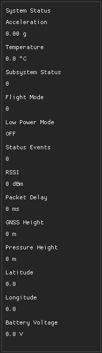
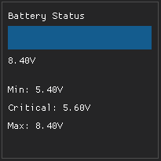
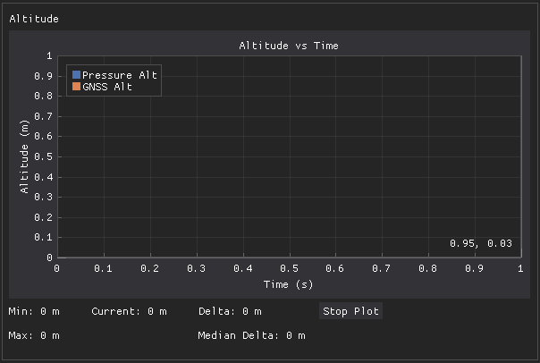
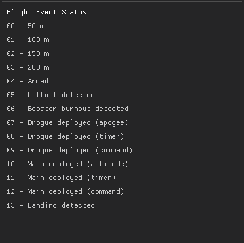
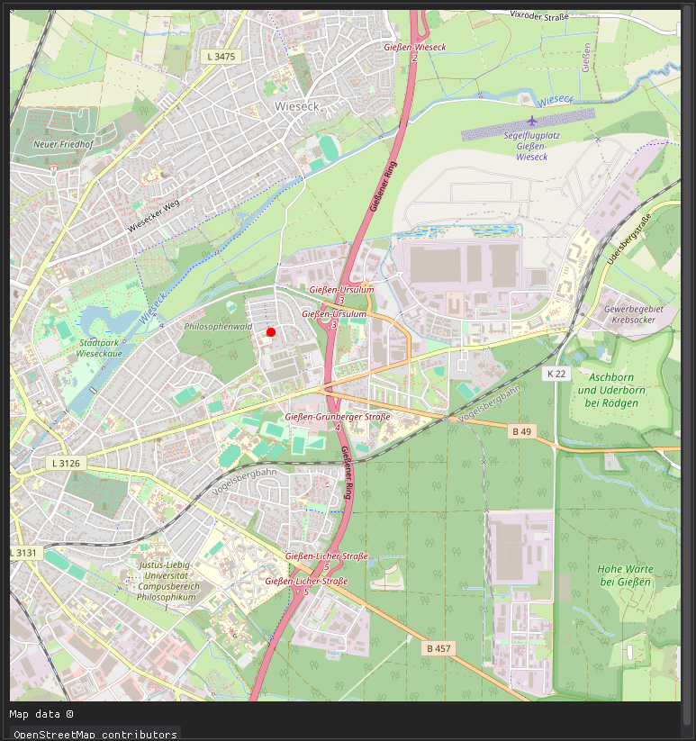
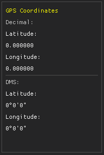
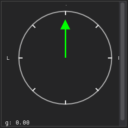
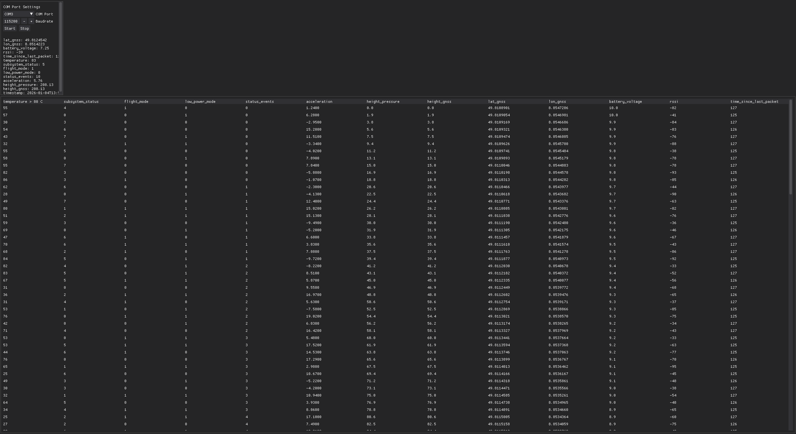

# MeerKat Ground Station Telemetry

Ground station software for receiving, visualizing, and monitoring rocket telemetry data developed by **Spaceflight Rocketry Gießen e.V.**

This application provides a real-time overview of flight data, system status, and position tracking using a modular and extensible UI.

---

## Overview

The MeerKat Ground Station is designed to monitor rockets during flight by visualizing incoming telemetry packets in real time.  
Each major UI component is modular and documented separately, allowing screenshots and images to be embedded per module.

---

## Main View

The main view consists of several distinct components:

### 1. Telemetry Packet Data

Located in the **top-left**, this panel displays all values contained in the most recent telemetry packet, including:

- System status
- Acceleration
- Temperature
- Flight mode
- GNSS data
- RSSI and packet delay

All values update live as new packets are received.

---

### 2. Battery Status

Displayed directly below the packet data, the battery status is shown as a **color-changing bar**:

- Green: Healthy voltage
- Yellow: Low voltage
- Red: Critical voltage

Thresholds are configurable in software.

---

### 3. Altitude Plot

Next to the telemetry data is the **Altitude vs Time** plot:

- Pressure-based altitude
- GNSS-based altitude
- Live updating time axis
- Plotting can be paused using the **Stop Plot** button

This allows post-event inspection during flight.

---

### 4. Flight Event Status

Below the altitude plot is the flight event status panel.

It tracks **14 flight events**, such as:

- Armed
- Liftoff detected
- Booster burnout
- Drogue deployment
- Main chute deployment
- Landing detected

Each event turns **green** once it has occurred.

---

### 5. Map View

The map displays the current rocket position using GNSS coordinates.

Features include:

- Zoom in / zoom out
- Cached map tiles for offline reuse
- Real-time position tracking

Map data is provided by **OpenStreetMap contributors**.

---

### 6. GPS Coordinates

To the right of the map, GNSS coordinates are displayed in:

- Decimal format
- Degrees / Minutes / Seconds (DMS)

This allows easy cross-referencing with other tracking tools.

---

### 7. G-Meter / Accelerometer Display

Located below the map, the G-meter visualizes acceleration:

- Vertical arrow showing up/down acceleration
- Numeric acceleration value displayed in the corner
- Ideal for detecting launch, burnout, and landing events

---

## COM Monitor View

The COM Monitor allows inspection of raw telemetry data:

- COM port selection
- Baud rate configuration
- Start/Stop connection
- Displays decoded telemetry fields
- Useful for debugging telemetry transmission

---

## Repository

Telemetry source code and documentation:  
https://github.com/Spaceflight-Rocketry-Giessen-e-V/Telemetry

---

## License

See repository for license information.
