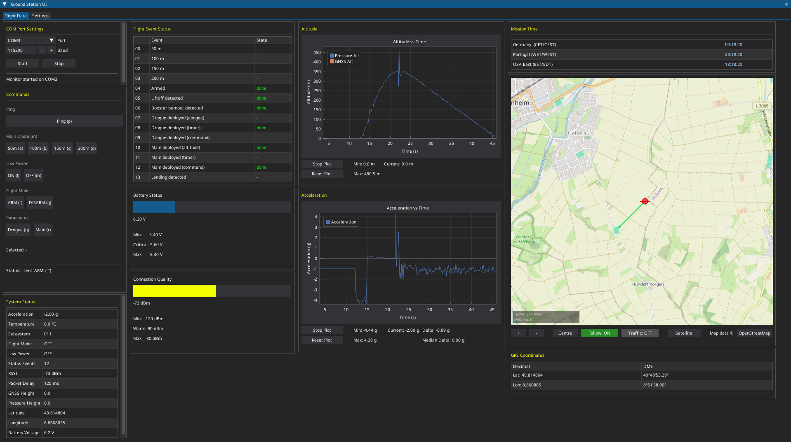

# Ground Station UI

A desktop telemetry ground station for monitoring rocketry flights in real time. Built with Python and DearPyGui.



---

## Tech Stack

- **Python 3.11+**
- **[DearPyGui](https://github.com/hoffstadt/DearPyGui)** — immediate-mode GUI framework
- **pyserial** — serial communication with the telemetry receiver
- **zoneinfo** — multi-timezone mission clock (stdlib)

---

## UI Overview

The interface is split into two tabs: Flight Data and Settings.

**Flight Data** shows:
- COM port controls (port selector, baud rate, start/stop)
- Command panel with a two-step confirm/abort flow before anything is sent
- Flight event status table (sequential, colour-coded)
- Battery voltage and connection quality (RSSI) progress bars
- Live altitude and acceleration plots with stop/reset/statistics controls
- System status table with the latest decoded packet fields
- Map view with live GPS tracking
- Mission clock in three time zones (Germany, Portugal, US East)

---

## Configuration

All thresholds and labels live in `settings.json` (auto-created on first run). You can edit them through the Settings tab at runtime — changes are written to disk immediately.

Configurable sections:

| Section | What you can change |
|---|---|
| `battery` | min / max / critical voltage |
| `connection` | RSSI min / warn / max |
| `flight_events` | event labels, abort threshold |
| `commands` | command groups, button labels, serial codes |

---

## Project Structure

```
├── telemetry/
│   ├── com_controller.py          # Serial receiver thread
│   └── com_monitor_controller.py  # UI-side serial control panel
├── ui/
│   ├── ui_manager.py              # Top-level update dispatcher
│   ├── settings_manager.py        # JSON-backed settings store
│   ├── acceleration_window.py
│   ├── altitude_window.py
│   ├── battery_window.py
│   ├── commands_window.py
│   ├── connection_window.py
│   ├── flight_events_window.py
│   ├── last_packet_window.py
│   ├── location_window.py
│   ├── map_view_window.py
│   ├── settings_window.py
│   └── time_window.py
└── settings.json                  # Auto-generated, edit via Settings tab
```
